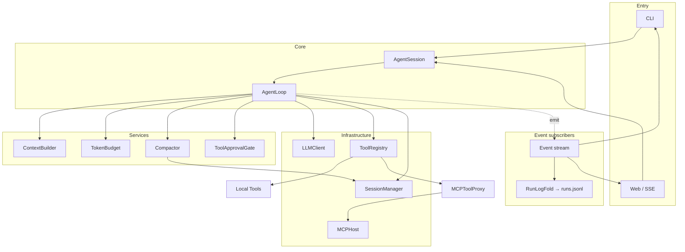

# MiniBot

[中文](README.md)

A local command-line AI agent built on OpenAI-compatible `chat.completions`. A synchronous turn loop with tool calling unifies local tools, MCP servers, skills, and cross-session memory.

## Features

- Local + MCP tools behind one `Tool` interface and schema
- Session persistence with automatic compaction when over budget
- Structured `RuntimeEvent` stream for CLI and SSE Web UI
- Progressive skill disclosure (L1 metadata in system prompt, L2 body via `read_skill`)
- Cross-session user memory (`remember` / `forget`)
- MCP via `stdio` / `streamable_http`; bundled SQLite demo and macOS system servers, with draw.io MCP in the default config

## Architecture



**Per-turn flow**

1. `AgentSession.prompt` — run lifecycle, per-session lock, cancellation, `run.*` events, event fan-out
2. `AgentLoop.run_turn` is the single owner; each iteration runs in order:
   - ① budget check (`TokenBudget`); if over budget, `Compactor.reduce` (compact + persist + emit)
   - ② `ContextBuilder.build` assembles the request as a pure function
   - ③ LLM call
   - ④ tool execution (approval via the injected `ToolApprovalGate`; batching from tool properties)
   - ⑤ message append (session persistence + event)
3. Every observable fact leaves through the event stream; `runs.jsonl` is `RunLogFold`'s fold over it
4. Large tool output is stored as artifacts via `ToolOutputMaterializer`; the model sees references only

**Tool fan-out**

```
ToolRegistry
├── Local Tools   fs / exec / web / memory / read_skill
└── MCPToolProxy  → stdio subprocess or streamable_http remote
                    naming: mcp__<server>__<tool>
```

**Design constraints**

| Principle | Detail |
|---|---|
| Single owner | `AgentLoop.run_turn` reads top-to-bottom as one turn's full lifecycle |
| Orchestration vs mechanics | The loop only decides and delegates; mechanics live in named components |
| One output channel | RuntimeEvent is the sole exit; UIs and the run log are subscribers |
| Sync turn loop | Main loop is synchronous; MCP asyncio lives in background threads |
| Append-only session | `messages.jsonl` is the source of truth; compaction appends and persists immediately |
| Projected view | `SessionContextProjector` derives model-visible messages from entries |
| In-loop context | Context is rebuilt every iteration, not pre-assembled once per turn |

The full architecture reference (layering rules, per-turn sequence, event catalog, compaction decision tree, error/cancellation/concurrency semantics) lives in [docs/architecture.md](docs/architecture.md); the design rationale in [docs/core-philosophy.md](docs/core-philosophy.md) (both Chinese).

## Modules

| Path | Role |
|---|---|
| `bootstrap.py` | Composition root; wires the runtime |
| `runtime/agent_session.py` | Run lifecycle, locks, cancellation, event fan-out |
| `runtime/agent_loop.py` | The core loop (single owner) |
| `runtime/context_builder.py` | Pure request assembly (system prompt / memory / skills) |
| `runtime/budget.py` | Token budget and incremental estimation |
| `runtime/compactor.py` | Compaction mechanics + immediate persistence |
| `runtime/approval.py` | Approval policy and the injected approval gate |
| `runtime/run_log_fold.py` | runs.jsonl as a fold over the event stream |
| `session/` | Append-only persistence + `SessionContextProjector` |
| `tools/` | Local `Tool` implementations and `ToolRegistry` |
| `mcp_host/` | MCP client, transports, `MCPToolProxy` |
| `mcp_servers/` | Bundled SQLite and macOS MCP servers |
| `skills/` | Skill metadata and Markdown bodies |
| `user_memory.py` | Global long-term memory |
| `cli.py` / `server.py` | CLI and Web entry points |

Cut-point rules live in `runtime/compaction.py` (pure functions); token estimation in `runtime/token_budget.py`.

## Quick start

Uses `uv` (Python 3.12):

```bash
cp .env.example .env   # set OPENAI_API_KEY
uv sync
uv run minibot
```

Web UI:

```bash
uv run minibot-server --host 127.0.0.1 --port 8765
# open http://127.0.0.1:8765/
```

CLI flags: `--verbose` (model rounds and context usage), `--no-color`.

## Configuration

### Agent (`.env`)

| Variable | Default | Purpose |
|---|---|---|
| `OPENAI_API_KEY` | — | Required |
| `OPENAI_BASE_URL` | official | OpenAI-compatible endpoint |
| `MINIBOT_MODEL` | `gpt-5.4-mini` | Model name |
| `MINIBOT_APPROVAL_MODE` | `ask` | `ask` / `always` |
| `MINIBOT_MAX_ITERATIONS` | `20` | Max LLM↔tool rounds per turn |
| `MINIBOT_MAX_PARALLEL_TOOLS` | `4` | Parallel tool calls per model response |
| `MINIBOT_COMPACT_TOKEN_THRESHOLD` | `40000` | Token threshold for auto-compaction |
| `MINIBOT_RESERVED_COMPLETION_TOKENS` | `4096` | Tokens reserved for model output |
| `MINIBOT_COMPACT_KEEP_RECENT_TOKENS` | `16000` | Recent context kept after compaction |
| `MINIBOT_INCLUDE_REASONING_CONTENT` | `auto` | Reasoning field passthrough (e.g. DeepSeek) |

Storage paths (no config needed):

- `<workspace>/.minibot/sessions/<id>/messages.jsonl` — sessions
- `<workspace>/.minibot/runs.jsonl` — run summaries
- `<workspace>/.minibot/sessions/<id>/artifacts/` — large tool output
- `~/.minibot/user_memory.json` — long-term memory

### MCP (`mcp.json`, global)

Lookup order: `MINIBOT_MCP_CONFIG_PATH` → `~/.minibot/mcp.json` → bundled `mcp.json`.

- Servers with `enabled: true` connect and discover tools at startup
- A single server failure does not block the rest
- `trusted: true` skips approval
- Transports support `${ENV_VAR}`, `${MINIBOT_PYTHON}`, `${MINIBOT_PACKAGE_DIR}`
- The bundled default config includes `sqlite`, `macos_system`, and an external draw.io MCP server launched through `npx -y @drawio/mcp`

## Web API

| Method | Path | Purpose |
|---|---|---|
| `POST` | `/runs` | Create a run; returns `run_id` |
| `GET` | `/runs/{run_id}/events` | SSE stream; supports `Last-Event-ID` |
| `POST` | `/runs/{run_id}/cancel` | Cancel a run |
| `POST` | `/runs/{run_id}/approvals/{approval_id}` | Resolve tool approval |
| `GET` | `/sessions` | List sessions |
| `GET` | `/sessions/current` | Current session |
| `POST` | `/sessions` | Create and switch current session |
| `GET/PATCH/DELETE` | `/sessions/{id}` | Read, rename, or delete a session |
| `GET` | `/sessions/{id}/messages` | Conversation history |

Disconnecting SSE only stops the subscription; it does not cancel the background run.

## CLI commands

`/sessions` · `/new` · `/resume <id>` · `/delete <id|current>` · `/compact` · `/mcp` · `/mcp tools [server]` · `/memory [clear|forget <id>]` · `/skills` · `/permission [ask|always]` · `/config` · `/help`

## Tests

```bash
uv run python -m unittest discover -s tests
```
