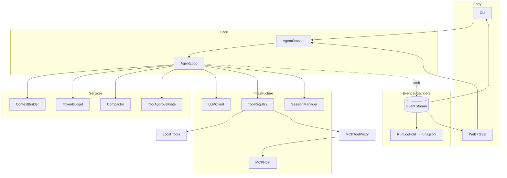

# MiniBot

[中文](README.md)

A local command-line AI agent runtime built on OpenAI-compatible `chat.completions`. A single-owner synchronous turn loop with tool calling, unifying local tools, MCP, Skills, and cross-session long-term memory; every runtime fact flows through one event stream to the CLI, the Web/SSE UI, and the run log.

## Capabilities

- Token-level streaming: CLI typewriter and Web streaming bubbles (`message.delta` events; `message.completed` stays authoritative)
- Local + MCP tools behind one `Tool` interface (declarative concurrency/approval properties)
- Append-only session persistence with automatic compaction (safe-cut-point summaries, read-only tool-block fallback)
- Structured `RuntimeEvent` as the sole output channel: CLI rendering, SSE Web UI, and runs.jsonl are all subscribers
- Progressive skill disclosure (L1 metadata resident in the system prompt, L2 body on demand via `read_skill`)
- Cross-session user memory (`remember` / `forget`) plus episodic memory (`search_history` searches raw messages and compaction summaries across all past sessions)
- Scheduled tasks and reminders: created in natural language (cron routines / one-shots), fired unattended by `minibot-daemon`, delivered via macOS notifications and stored as searchable sessions
- Sensitive-tool approval (`ask` / `always`; CLI prompt or Web approval endpoint)
- Reliability: exponential-backoff retries for transient LLM errors (never after the first delta), summariser failures degrade to truncation, tool args pre-validated against their JSON Schema
- MCP over `stdio` / `streamable_http`; bundled SQLite demo and macOS system servers, draw.io MCP in the default config

## Quick start

Uses `uv` (Python 3.12):

```bash
cp .env.example .env   # set OPENAI_API_KEY
uv sync
uv run minibot
```

Web UI:

```bash
uv run minibot-server --host 127.0.0.1 --port 8765
# open http://127.0.0.1:8765/
```

`minibot` opens a **full-screen TUI** (Textual) by default: scrollable conversation, Markdown-rendered replies, streaming, reasoning and tool calls collapsed into clickable one-liners, a bottom-pinned input, and an approval modal (y/n); `Esc` cancels the run, `Ctrl+N` starts a session. Slash commands work as usual.

The line REPL remains as `minibot --plain` (auto-fallback when piped): `--verbose`, `--no-color`, spinner status bar, typewriter streaming, and the collapsing reasoning preview all behave as before.

## Architecture



**Per-turn flow** — `AgentLoop.run_turn` is the single owner; each iteration runs in order:

1. Budget check (`TokenBudget`); if over budget, `Compactor.reduce` (compact + persist + emit)
2. `ContextBuilder.build` assembles the request as a pure function (system prompt / memory / time / skills catalog + projected history)
3. Streamed LLM call (deltas publish as `message.delta` events; the terminal `LLMResponse` drives everything downstream)
4. Tool execution (approval via the injected `ToolApprovalGate`; consecutive read-only tools run as a parallel batch)
5. Message append (session persistence + event); large outputs become artifact references via `ToolOutputMaterializer`

**Design constraints**

| Principle | Detail |
|---|---|
| Single owner | `run_turn` reads top-to-bottom as one turn's full lifecycle; turn state lives only in loop locals |
| Orchestration vs mechanics | The loop only decides and delegates; mechanics live in named, independently testable components |
| One output channel | RuntimeEvent is the sole exit; `runs.jsonl` is `RunLogFold`'s fold over the stream |
| Append-only session | `messages.jsonl` is the source of truth; compaction appends an entry and persists immediately |
| Projected view | `SessionContextProjector` derives model-visible messages (incl. incomplete tool-transaction filtering) |
| Sync turn loop | Main loop is synchronous; MCP asyncio lives in background threads |

Deep dives: **[docs/architecture.md](docs/architecture.md)** — layering rules, per-turn sequence diagram, the full event catalog, the compaction decision tree, error/cancellation/concurrency semantics; **[docs/core-philosophy.md](docs/core-philosophy.md)** — the judgment criteria behind this shape (both in Chinese).

## Modules

| Path | Role |
|---|---|
| `bootstrap.py` | Composition root; wires the runtime |
| `runtime/agent_session.py` | Run lifecycle: session lock, cancellation, `run.*` events, event fan-out |
| `runtime/agent_loop.py` | The core loop (single owner) |
| `runtime/context_builder.py` | Pure request assembly |
| `runtime/budget.py` | Token budget and incremental estimation |
| `runtime/compactor.py` | Compaction mechanics + immediate persistence (cut-point rules in `compaction.py`) |
| `runtime/approval.py` | Approval policy and the injected approval gate |
| `runtime/run_log_fold.py` | runs.jsonl as a fold over the event stream |
| `session/` | Append-only persistence + projection |
| `tools/` | Local `Tool` implementations and `ToolRegistry` |
| `mcp_host/` | MCP client, transports, `MCPToolProxy` |
| `mcp_servers/` | Bundled SQLite / macOS MCP servers |
| `skills/` | Skill metadata and Markdown bodies |
| `user_memory.py` | Global long-term memory |
| `cli.py` / `server.py` | CLI and Web entry points |

## Configuration

### Agent (`.env`)

| Variable | Default | Description |
|---|---|---|
| `OPENAI_API_KEY` | — | required |
| `OPENAI_BASE_URL` | official | OpenAI-compatible endpoint |
| `MINIBOT_MODEL` | `gpt-5.4-mini` | model name |
| `MINIBOT_APPROVAL_MODE` | `ask` | `ask` / `always` |
| `MINIBOT_MAX_ITERATIONS` | `20` | max LLM↔tool rounds per turn |
| `MINIBOT_MAX_PARALLEL_TOOLS` | `4` | parallel tool cap per response |
| `MINIBOT_COMPACT_TOKEN_THRESHOLD` | `40000` | token threshold that triggers compaction |
| `MINIBOT_RESERVED_COMPLETION_TOKENS` | `4096` | tokens reserved for output |
| `MINIBOT_COMPACT_KEEP_RECENT_TOKENS` | `16000` | recent context kept after compaction |
| `MINIBOT_INCLUDE_REASONING_CONTENT` | `auto` | reasoning-field passthrough (DeepSeek etc.) |
| `MINIBOT_STREAMING` | `auto` | set `0`/`off` to disable streaming (for endpoints with broken SSE) |
| `MINIBOT_LLM_MAX_RETRIES` | `3` | max retries for transient LLM errors (429/5xx/connection) |
| `MINIBOT_HOME` | `~/.minibot` | global state home (sessions / run log / memory / mcp.json) |

Persistence — **state is centralized globally** (default `~/.minibot`, override with `MINIBOT_HOME`). Conversations belong to the user, not to the launch directory; the workspace only roots the fs/exec tools and is recorded as session metadata:

- `~/.minibot/sessions/<id>/messages.jsonl` — all sessions (append-only; meta records workspace provenance)
- `~/.minibot/runs.jsonl` — run summaries (fold of the event stream)
- `~/.minibot/sessions/<id>/artifacts/` — large tool outputs
- `~/.minibot/user_memory.json` — long-term memory

Legacy per-workspace `.minibot` directories migrate with one command (id collisions renamed, run logs merged):

```bash
uv run minibot --migrate <dir1> <dir2> ...
```

### MCP (`mcp.json`, global)

Lookup order: `MINIBOT_MCP_CONFIG_PATH` → `~/.minibot/mcp.json` → bundled `mcp.json`.

- Servers with `enabled: true` connect and discover tools at startup; one failing server never blocks startup
- `trusted: true` skips approval
- Transports support `${ENV_VAR}`, `${MINIBOT_PYTHON}`, `${MINIBOT_PACKAGE_DIR}`
- The bundled config includes `sqlite`, `macos_system`, and an external draw.io MCP server launched via `npx -y @drawio/mcp`

## Scheduled tasks

Say "generate my daily brief at 8 every morning" or "remind me to submit the report tomorrow at 9" in conversation — MiniBot calls `schedule_task` (approval-gated) and writes `~/.minibot/schedule.json`. Firing needs the resident daemon:

```bash
uv run minibot-daemon    # resident process; single-instance lock
```

- Routines use five-field cron (local time); one-shot reminders use ISO timestamps
- Each firing creates a fresh `[定时]` session (searchable via `search_history`) and posts a macOS notification
- Missed firings catch up within a one-hour grace window (laptop lid, daemon downtime); older misses are recorded and skipped
- Unattended runs deny sensitive tools by default; set `MINIBOT_APPROVAL_MODE=always` for the daemon at your own risk
- Manage with `/tasks`, `/tasks cancel <id>`, or plain natural language

**Heartbeat**: cron executes a fixed instruction on time; heartbeat wakes up and decides for itself. Say "patrol every 30 minutes" to create one (`schedule_task` with `heartbeat` mode): on each beat it reviews the `~/.minibot/HEARTBEAT.md` checklist (inlined into the prompt) inside **one persistent session**, does what needs doing, and replies `HEARTBEAT_OK` to stay silent when nothing needs you — notifications fire only when something does. The checklist is plain Markdown (`#` lines are comments); the ever-growing session is kept in check by automatic compaction.

## CLI commands

`/sessions` · `/new` · `/resume <id>` · `/delete <id|current>` · `/compact` · `/mcp` · `/mcp tools [server]` · `/memory [clear|forget <id>]` · `/skills` · `/tasks [cancel <id>]` · `/permission [ask|always]` · `/config` · `/help`

## Web API

| Method | Path | Description |
|---|---|---|
| `POST` | `/runs` | create a run, returns `run_id` |
| `GET` | `/runs/{run_id}/events` | SSE with `Last-Event-ID` replay |
| `POST` | `/runs/{run_id}/cancel` | cancel a run |
| `POST` | `/runs/{run_id}/approvals/{approval_id}` | resolve a tool approval |
| `GET` | `/sessions` | list sessions |
| `GET` | `/sessions/current` | current session |
| `POST` | `/sessions` | create and switch the current session |
| `GET/PATCH/DELETE` | `/sessions/{id}` | read, retitle, delete a session |
| `GET` | `/sessions/{id}/messages` | conversation history |

Disconnecting from SSE only cancels the subscription, not the background run.

## Tests

```bash
uv run python -m unittest discover -s tests
```

Event names and payloads are the stable contract shared by the CLI, SSE, and the run log; consult the event catalog in [docs/architecture.md](docs/architecture.md) before changing them.
