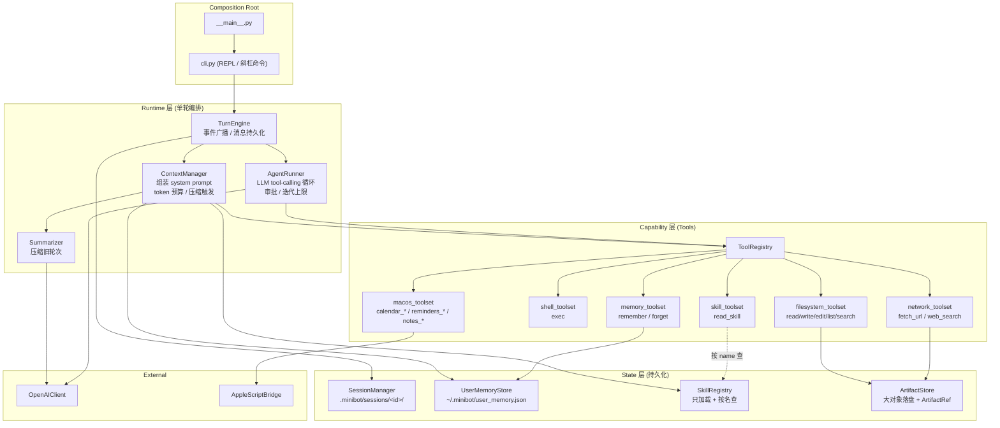
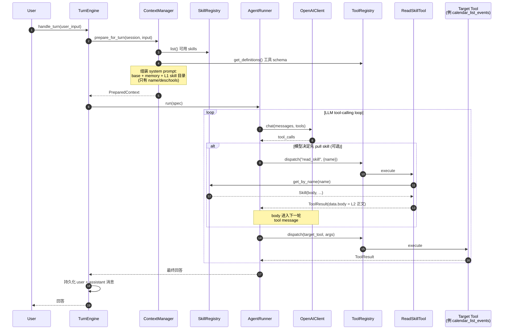
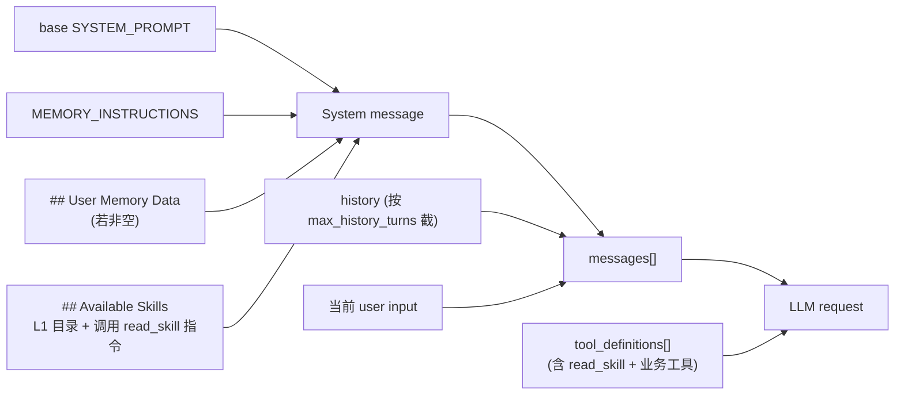

# MiniBot

一个本地命令行 AI agent。核心能力是：

- tool calling
- 会话持久化
- 长输出 artifact 化
- 自动 compaction
- 全局用户长期记忆
- 基于 skill 的 workflow guidance
- macOS Calendar / Reminders / Notes 联动

## 快速开始

在仓库根目录创建 `.env`：

```bash
OPENAI_API_KEY=sk-xxx
OPENAI_BASE_URL=
MINIBOT_MODEL=gpt-5.4-mini
```

运行：

```bash
python -m minibot
```

## CLI

常用命令：

- `/sessions`：查看会话列表
- `/new`：新建会话
- `/resume <id>`：恢复会话
- `/delete <id|current>`：删除会话
- `/compact`：手动压缩当前会话
- `/memory`：查看长期记忆
- `/memory clear`：清空长期记忆
- `/memory forget <id>`：删除单条长期记忆
- `/skills`：查看当前可用 skills
- `/help`：显示帮助

## 当前目录结构

```text
minibot/
├── __main__.py
├── cli.py
├── ui.py
├── config.py
├── llm.py
├── prompts.py
├── artifacts.py
├── user_memory.py
├── runtime/
│   ├── __init__.py
│   ├── agent_runner.py
│   ├── context_manager.py
│   └── turn_engine.py
├── tools/
│   ├── __init__.py
│   ├── base.py
│   ├── registry.py
│   ├── result.py
│   ├── exec_cmd.py
│   ├── read_file.py
│   ├── read_artifact.py
│   ├── read_skill.py
│   ├── write_file.py
│   ├── edit_file.py
│   ├── list_dir.py
│   ├── search_files.py
│   ├── web_search.py
│   ├── fetch_url.py
│   ├── memory_tools.py
│   └── macos_apps.py
├── macos/
│   ├── __init__.py
│   └── bridge.py
├── session/
│   ├── __init__.py
│   ├── models.py
│   └── store.py
├── skills/
│   ├── __init__.py
│   ├── registry.py
│   ├── calendar.md
│   ├── reminders.md
│   └── notes.md
└── tests/
```

## 架构

### 分层组件图



核心分工：

- **Runtime** 只做编排，不拥有业务逻辑
- **Capability** 所有能力都挂在 `ToolRegistry` 下，按 toolset 装配
- **State** 三种存储各司其职：会话 / 长期记忆 / skill 目录
- `SkillRegistry` 在热路径上只出现在 prompt 装配（拿 L1 目录）和 `read_skill` 工具（按 name 查）两处

### 一轮对话（含 skill pull 链路）



## Prompt 组装

`ContextManager` 每轮重新拼一次请求。结构如下：



分工：

- `tools` 是 function calling 能力，走 `tool_definitions`
- `skills` 是 workflow guidance，走 `tool_definitions` 里的 `read_skill` **按需拉取**

当前 skill 策略（progressive disclosure / model-pulled）：

- **L1 metadata**（name / description / tools）每轮常驻在系统提示的 `## Available Skills` 块
- **L2 body** 不由框架匹配注入，只在模型调用 `read_skill` 时进 tool message
- 是否加载、加载哪个、加载几个，完全由模型自行判断
- 框架不再做 trigger 匹配、不再有 top-2 / full / summary 三档模式
- L2 内容走 tool message 通道进上下文，模型清楚那是"刚加载的参考资料"而不是"新系统规则"

## Tool 体系

当前工具按 toolset 装配：

- `filesystem_toolset`
  - `read_file`
  - `read_artifact`
  - `write_file`
  - `edit_file`
  - `list_dir`
  - `search_files`
- `shell_toolset`
  - `exec`
- `network_toolset`
  - `web_search`
  - `fetch_url`
- `memory_toolset`
  - `remember`
  - `forget`
- `macos_toolset`
  - `calendar_list_events`
  - `calendar_create_event`
  - `reminders_list`
  - `reminders_create`
  - `reminders_complete`
  - `notes_search`
  - `notes_create`
  - `notes_append`
- `skill_toolset`
  - `read_skill`

### ToolResult

所有工具都统一返回 `ToolResult`：

```json
{
  "ok": true,
  "code": "success",
  "summary": "已读取 foo.py（8241 字符，已截断预览）。",
  "data": {
    "path": "foo.py",
    "preview": "...",
    "total_chars": 8241
  },
  "artifact": {
    "id": "a_123abc456def",
    "kind": "file",
    "name": "foo.py"
  },
  "truncated": true
}
```

约束：

- `data` 只放小而稳定的结构化内容
- 大内容走 artifact
- 模型只能看到 `ok/code/summary/data/artifact/truncated`
- `meta` 只用于本地调试，不进 prompt

## 持久化

### Session

每个会话落在：

```text
.minibot/sessions/<session_id>/
├── meta.json
├── messages.jsonl
└── artifacts/
    └── <artifact_id>.json
```

说明：

- `meta.json`：标题、时间、message_count
- `messages.jsonl`：transcript，只存 user / assistant / tool 历史，供后续拼上下文
- `artifacts/`：长文件、长输出、长网页内容

当前会话指针在：

```text
.minibot/current_session
```

### Run Log

每轮用户输入还会额外追加一条运行摘要日志：

```text
.minibot/runs.jsonl
```

说明：

- `runs.jsonl`：turn 级观测摘要日志，记录耗时、工具数、工具名、compact 情况、错误摘要等
- run log 不进入模型上下文，也不替代 session transcript

### Long-term Memory

全局长期记忆在：

```text
~/.minibot/user_memory.json
```

这里只存稳定事实，不存临时任务进度。

## macOS 集成

`macos_toolset()` 只会在下面条件满足时注册：

- `sys.platform == "darwin"`
- 系统存在 `osascript`

底层统一走 [macos/bridge.py](/Users/jiminyang/Desktop/ai-projects/agent/minibot/macos/bridge.py) 里的 `AppleScriptBridge`，不暴露通用 `run_applescript` tool。

当前范围只做：

- Calendar
- Reminders
- Notes

暂不做：

- Clock / Alarm
- 通用 app 控制
- UI automation fallback

所有本地写操作都要求 approval。

## 配置

环境变量：

```bash
OPENAI_API_KEY=sk-xxx
OPENAI_BASE_URL=
MINIBOT_MODEL=gpt-5.4-mini
MINIBOT_MAX_ITERATIONS=20
MINIBOT_MAX_HISTORY_TURNS=40
MINIBOT_COMPACT_TOKEN_THRESHOLD=40000
MINIBOT_RESERVED_COMPLETION_TOKENS=4096
MINIBOT_COMPACT_KEEP_RECENT=10
MINIBOT_AUTO_APPROVE=false
```

默认参数：

| 参数 | 默认值 | 说明 |
| --- | --- | --- |
| `model` | `gpt-5.4-mini` | 默认模型 |
| `max_iterations` | `20` | 单轮 tool-calling 最大迭代次数 |
| `max_history_turns` | `40` | 带入模型的最大历史轮次 |
| `compact_token_threshold` | `40000` | 请求 token 预算上限 |
| `reserved_completion_tokens` | `4096` | 给模型输出预留的预算 |
| `compact_keep_recent` | `10` | 压缩时保留的最近轮次 |
| `auto_approve` | `false` | 是否自动批准敏感工具 |

## 测试

跑全部测试：

```bash
python -m unittest discover -s tests
```

跑 macOS integration：

```bash
MINIBOT_RUN_MACOS_INTEGRATION=1 python -m unittest tests.test_macos_integration
```

默认会跳过这些集成测试，避免直接改你的日历、提醒和笔记。

## 已知边界

- `fetch_url` 更适合静态网页、普通文章页和 SSR 页面；纯前端重渲染页面不保证能拿到完整正文
- skill 采用 pull 模式：L1 目录常驻、L2 正文按需 `read_skill`；框架不再做 trigger 匹配，模型不读就不加载
- 若 skill 正文没有 L1 目录无法传达的关键信息（默认值、跨工具编排、错误恢复等），模型多半不会去 pull——这是预期行为，不是 bug
- artifact 是 session-scoped，不是全局 blob store
