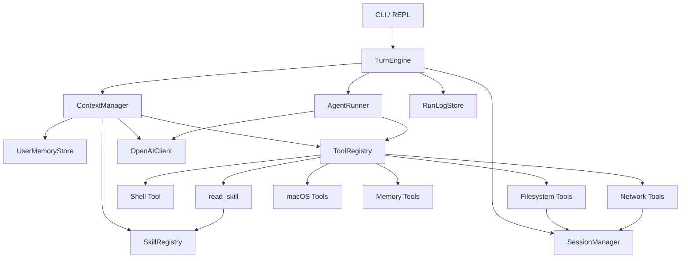

# MiniBot

本地命令行 AI agent，基于 OpenAI-compatible `chat.completions`，支持：

- tool calling
- 会话持久化
- 自动 compact
- 用户长期记忆
- skills 按需读取
- macOS Calendar / Reminders / Notes 工具

## 快速开始

在仓库根目录创建 `.env`：

```bash
OPENAI_API_KEY=sk-xxx
OPENAI_BASE_URL=
MINIBOT_MODEL=gpt-5.4-mini
```

安装依赖并启动：

```bash
pip install -r requirements.txt
python -m minibot
```

## 常用命令

- `/sessions` 查看会话列表
- `/new` 新建会话
- `/resume <id>` 恢复会话
- `/delete <id|current>` 删除会话
- `/compact` 手动压缩当前会话
- `/memory` 查看长期记忆
- `/memory clear` 清空长期记忆
- `/memory forget <id>` 删除单条长期记忆
- `/skills` 查看可用 skills
- `/help` 显示帮助

## 关键目录

```text
minibot/
├── __main__.py
├── config.py
├── llm.py
├── runtime/
├── session/
├── tools/
├── skills/
└── tests/
```

## 运行方式

- `TurnEngine` 负责单轮编排和持久化
- `ContextManager` 负责 system prompt、历史、memory 和 compact
- `AgentRunner` 负责 tool-calling 循环
- `ToolRegistry` 统一管理工具定义和执行
- 会话保存在 `.minibot/sessions/<session_id>/`
- run log 保存在 `.minibot/runs.jsonl`

## 架构图



## 配置

可用环境变量：

```bash
MINIBOT_MODEL=gpt-5.4-mini
MINIBOT_MAX_ITERATIONS=20
MINIBOT_MAX_HISTORY_TURNS=40
MINIBOT_COMPACT_TOKEN_THRESHOLD=40000
MINIBOT_RESERVED_COMPLETION_TOKENS=4096
MINIBOT_COMPACT_KEEP_RECENT=10
MINIBOT_AUTO_APPROVE=false
```

## 测试

运行全部测试：

```bash
python -m unittest discover -s tests
```

运行 macOS integration：

```bash
MINIBOT_RUN_MACOS_INTEGRATION=1 python -m unittest tests.test_macos_integration
```

## 说明

- `fetch_url` 更适合公开网页和普通文章页，不保证拿到纯前端站点的完整正文
- skill 采用 pull 模式：目录常驻，正文由模型通过 `read_skill` 按需读取
- 大输出会写入 artifact，而不是直接塞进 tool result
