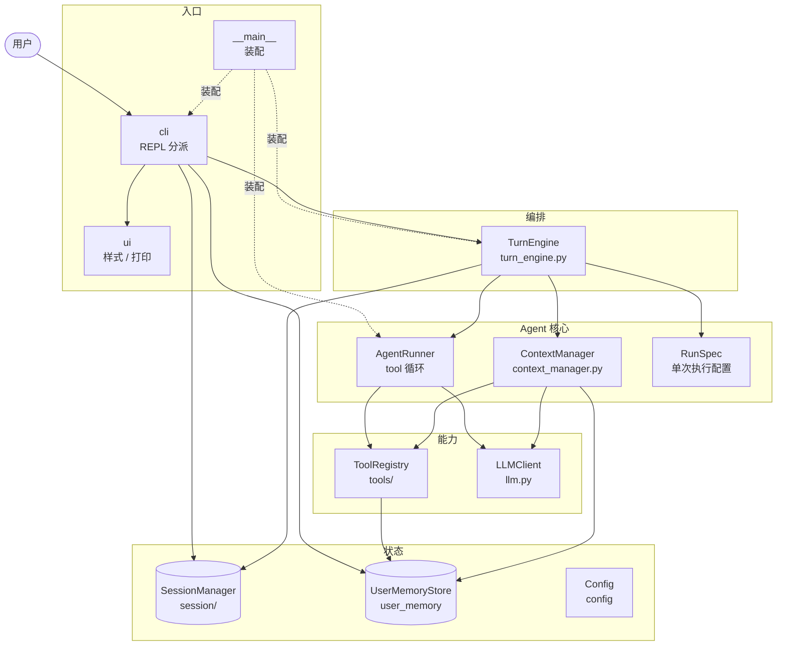
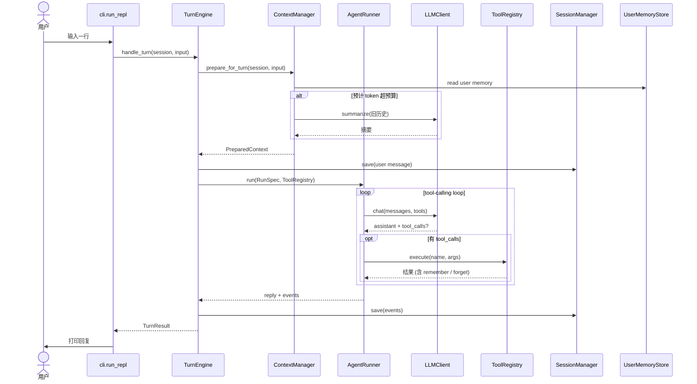

# MiniBot

一个从零构建的命令行 AI Agent，基于 OpenAI 兼容 API，具备工具调用、会话持久化和自动压缩能力。

## 快速开始

```bash
# 配置
cp .env.example .env
# 编辑 .env 填入 OPENAI_API_KEY

# 运行
python -m minibot
```

## 架构

### 分层视图

自上而下：外层负责"何时做"，内层负责"怎么做"。

```
┌───────────────────  入口  ───────────────────┐
│  __main__.py                  装配与启动     │
│  cli.py  +  ui.py             REPL 分派 / 样式│
├───────────────────  编排  ───────────────────┤
│  turn_engine.py (TurnEngine)  一轮消息编排   │
├──────────────────  Agent 核心  ──────────────┤
│  context_manager.py ContextManager 上下文准备+压缩│
│  agent_runner.py  RunSpec+Runner  tool-calling│
├───────────────────  能力  ───────────────────┤
│  tools/                       工具抽象 + 实现│
│  llm.py                       LLM 抽象 + 实现│
├───────────────────  状态  ───────────────────┤
│  session/                     短期记忆       │
│  user_memory.py               长期记忆       │
│  config.py  prompts.py        配置 / 提示词  │
└──────────────────────────────────────────────┘
```

### 组件依赖

实线 = 调用，虚线 = 构造期装配。



## 模块说明

| 模块 | 职责 |
|------|------|
| `__main__.py` | 入口：加载配置 → 组装依赖 → 启动 REPL |
| `agent_runner.py` | `RunSpec` + `AgentRunner` — 单次执行配置与 tool-calling 执行器 |
| `context_manager.py` | `ContextManager` — 统一组装 system prompt、全局 user memory、history、user input，并在内部处理 token 预算与压缩 |
| `llm.py` | LLM 抽象层 — `LLMClient` 接口 + `OpenAIClient` 实现 |
| `turn_engine.py` | `TurnEngine` — 只做一轮消息编排：prepare context、runner 调用与持久化 |
| `cli.py` | REPL 交互 — 斜杠命令分派（`/sessions`, `/resume`, `/new`, `/delete`, `/compact`, `/memory`），只管编排，不管视觉 |
| `ui.py` | 终端样式与打印 helper — ANSI 颜色、banner/status/help 面板、`tool_log`、`prompt_approval`，全项目唯一的输出出口 |
| `config.py` | 配置中心 — `.env` 解析 + `Config` dataclass |
| `prompts.py` | 系统提示词（对话 + 长期记忆指令 + 摘要） |
| `user_memory.py` | `UserMemoryStore` — 全局 user memory，持久化在 `~/.minibot/user_memory.json`，只负责结构化存取 |
| `session/models.py` | `MessageEvent` + `Session` 领域模型 |
| `session/store.py` | `SessionManager` — JSONL 会话持久化 + 当前会话指针 |
| `tools/` | `Tool` 抽象 + `ToolRegistry` + 工具实现（`exec`、`read_file`、`write_file`、`list_dir`、`search_files`、`remember`、`forget`） |

## 一轮对话的时序



要点：

- **ContextManager** = 基础 prompt + 长期记忆指令 + 当前记忆 + history + user input 的统一入口
- **compaction** 是 `ContextManager` 的内部一个分支，而不是 `TurnEngine` 的独立步骤
- **tool 循环**最多 `max_iterations` 轮；无 `tool_calls` 时直接返回最终回答
- **持久化**发生两次：user 输入落盘一次、runner 结束后把 assistant/tool 事件落盘一次

## 设计决策

**TurnEngine 是运行时中心** — 一轮消息从头到尾的 orchestration 都由 `TurnEngine` 管理：context usage log、compact、history、runner 调用、session save/load。

**ContextManager 收口上下文准备** — prompt 组装、长期记忆注入、token 估算和压缩分支都统一由 `ContextManager` 处理，`TurnEngine` 不再自己拼 prompt 或显式调 compaction。

**RunSpec / AgentRunner 分离** — `RunSpec` 只描述一次执行要用的 `model / max_iterations / messages / tool_definitions`，`AgentRunner` 只负责 tool-calling execution loop。

**Tool 抽象 + ToolRegistry** — 工具不是零散函数，而是统一的能力对象；`ToolRegistry` 负责暴露 function schema 和按名称调度执行。

**LLM 可替换** — `LLMClient` 是抽象接口，实现 `chat()` 方法即可接入任何 provider（OpenAI、DeepSeek、本地模型等）。

**Request-time token 压缩** — 压缩判断基于真实请求 payload：`system prompt + visible history + current user input + tools schema`，再扣除预留输出 token。

**工具安全** — `exec` 工具内置危险命令正则拦截（rm -rf、dd、fork bomb 等）。

**会话持久化** — JSONL 格式存储在 `.minibot/sessions/`，当前会话指针存储在 `.minibot/current_session`；若指针悬空会自动清理并修正。

**长期记忆（跨 session）** — `UserMemoryStore` 持久化在 `~/.minibot/user_memory.json`，只保存全局用户事实（姓名、环境、偏好、固定习惯）。`ContextManager` 会把这些内容以 data block 形式按 token 预算小块注入上下文。Agent 通过 `remember` / `forget` 两个工具主动管理；REPL 可用 `/memory`、`/memory clear`、`/memory forget <id>` 查看和编辑。

## 配置

通过 `.env` 或环境变量：

```bash
OPENAI_API_KEY=sk-xxx          # 必填
OPENAI_BASE_URL=               # 可选，自定义 API 端点
MINIBOT_MODEL=gpt-5.4-mini     # 可选，默认模型
```

`Config` 内部参数：

| 参数 | 默认值 | 说明 |
|------|--------|------|
| `max_iterations` | 20 | 单轮 tool-calling 的最大迭代次数 |
| `max_history_turns` | 40 | 送给模型的最大历史轮次 |
| `compact_token_threshold` | 40000 | 触发压缩的 token 阈值 |
| `reserved_completion_tokens` | 4096 | 为模型输出预留的 token 预算 |
| `compact_keep_recent` | 10 | 压缩时保留的最近轮次数 |
