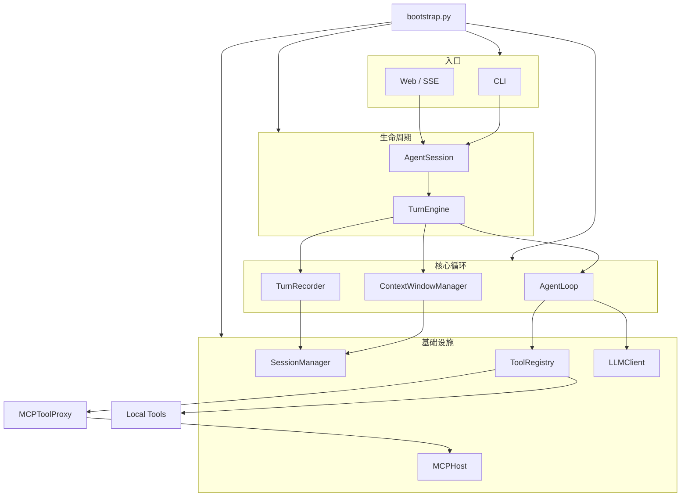

# MiniBot

[English](README.en.md)

本地命令行 AI agent，基于 OpenAI-compatible `chat.completions`。同步 turn loop + tool calling，统一接入本地工具、MCP、Skills 与跨会话长期记忆。

## 能力

- 本地工具 + MCP 工具（统一 `Tool` 接口与 schema）
- 会话持久化，超预算自动 compact
- 结构化 `RuntimeEvent` + CLI / SSE Web UI
- Skills 渐进披露（L1 元数据常驻，L2 正文按需 `read_skill`）
- 跨会话用户长期记忆（`remember` / `forget`）
- MCP：`stdio` / `streamable_http`；内置 SQLite demo、macOS system server，默认配置可接 draw.io MCP

## 架构



**单轮数据流**

1. `AgentSession.prompt` — run 生命周期、会话锁、取消、`run.*` 事件
2. `TurnEngine` 向 `AgentLoop` 注入两个回调：
   - `prepare_next_turn()` → `ContextWindowManager` 投影上下文、组装 prompt、必要时 compact
   - `on_message()` → `TurnRecorder` 逐条 append 到 session
3. `AgentLoop` 每个 iteration：`prepare_next_turn` → LLM → hooks → `ToolRegistry` → `on_message`
4. 大 tool 输出经 `ToolOutputMaterializer` 落盘为 artifact，模型只收到引用

**工具扇出**

```
ToolRegistry
├── Local Tools   fs / exec / web / memory / read_skill
└── MCPToolProxy  → stdio 子进程 或 streamable_http 远端
                    命名：mcp__<server>__<tool>
```

**设计约束**

| 原则 | 说明 |
|---|---|
| 同步 turn loop | 主循环同步；MCP asyncio 隔离在后台线程 |
| Append-only session | `messages.jsonl` 是唯一真相源；compact 只追加 entry |
| 投影视图 | `SessionContextProjector` 从 entry 生成模型可见消息 |
| 循环内上下文 | 每 iteration 重投影，非 turn 开始前一次性拼好 |
| 窄 hook 接口 | 仅暴露 `run_id` / `session_id` / `workspace` / `mode` / `emitter` / `cancel_event` |

## 模块

| 路径 | 职责 |
|---|---|
| `bootstrap.py` | Composition root，组装 runtime |
| `runtime/` | `AgentSession` · `TurnEngine` · `AgentLoop` · `ContextWindowManager` · hooks · events |
| `session/` | Append-only 持久化 + `SessionContextProjector` |
| `tools/` | 本地 `Tool` 实现与 `ToolRegistry` |
| `mcp_host/` | MCP 客户端、transport、`MCPToolProxy` |
| `mcp_servers/` | 内置 SQLite / macOS MCP server |
| `skills/` | Skill 元数据与 Markdown 正文 |
| `user_memory.py` | 全局长期记忆 |
| `cli.py` / `server.py` | CLI 与 Web 入口 |

Compact 规则在 `runtime/compaction.py`，token 估算在 `runtime/token_budget.py`。

## 快速开始

使用 `uv` 管理环境（Python 3.12）：

```bash
cp .env.example .env   # 填入 OPENAI_API_KEY
uv sync
uv run minibot
```

Web UI：

```bash
uv run minibot-server --host 127.0.0.1 --port 8765
# 打开 http://127.0.0.1:8765/
```

CLI 选项：`--verbose`（模型轮次与 context usage）、`--no-color`。

## 配置

### Agent（`.env`）

| 变量 | 默认 | 说明 |
|---|---|---|
| `OPENAI_API_KEY` | — | 必填 |
| `OPENAI_BASE_URL` | 官方 | 兼容 OpenAI 的 endpoint |
| `MINIBOT_MODEL` | `gpt-5.4-mini` | 模型名 |
| `MINIBOT_APPROVAL_MODE` | `ask` | `ask` / `always` |
| `MINIBOT_MAX_ITERATIONS` | `20` | 单 turn 最大 LLM↔tool 轮次 |
| `MINIBOT_MAX_PARALLEL_TOOLS` | `4` | 同响应并发 tool 上限 |
| `MINIBOT_COMPACT_TOKEN_THRESHOLD` | `40000` | 触发 compact 的 token 阈值 |
| `MINIBOT_RESERVED_COMPLETION_TOKENS` | `4096` | 预留给输出的 token |
| `MINIBOT_COMPACT_KEEP_RECENT_TOKENS` | `16000` | compact 后保留的近期上下文 |
| `MINIBOT_INCLUDE_REASONING_CONTENT` | `auto` | DeepSeek 等 reasoning 字段回传策略 |

持久化路径（无需配置）：

- `<workspace>/.minibot/sessions/<id>/messages.jsonl` — 会话
- `<workspace>/.minibot/runs.jsonl` — 运行摘要
- `<workspace>/.minibot/sessions/<id>/artifacts/` — 大 tool 输出
- `~/.minibot/user_memory.json` — 长期记忆

### MCP（`mcp.json`，全局）

查找顺序：`MINIBOT_MCP_CONFIG_PATH` → `~/.minibot/mcp.json` → 包内 `mcp.json`。

- `enabled: true` 的 server 启动时连接并发现工具
- 单 server 失败不阻塞整体启动
- `trusted: true` 免审批
- transport 支持 `${ENV_VAR}`、`${MINIBOT_PYTHON}`、`${MINIBOT_PACKAGE_DIR}`
- 包内默认配置包含 `sqlite`、`macos_system`，以及通过 `npx -y @drawio/mcp` 启动的外部 draw.io MCP server

## Web API

| 方法 | 路径 | 说明 |
|---|---|---|
| `POST` | `/runs` | 创建 run，返回 `run_id` |
| `GET` | `/runs/{run_id}/events` | SSE，支持 `Last-Event-ID` |
| `POST` | `/runs/{run_id}/cancel` | 取消 run |
| `POST` | `/runs/{run_id}/approvals/{approval_id}` | 审批工具调用 |
| `GET` | `/sessions` | 会话列表 |
| `GET` | `/sessions/current` | 当前会话 |
| `POST` | `/sessions` | 创建并切换当前会话 |
| `GET/PATCH/DELETE` | `/sessions/{id}` | 读取、改标题、删除会话 |
| `GET` | `/sessions/{id}/messages` | 对话历史 |

SSE 断开只取消订阅，不取消后台 run。

## CLI 命令

`/sessions` · `/new` · `/resume <id>` · `/delete <id|current>` · `/compact` · `/mcp` · `/mcp tools [server]` · `/memory [clear|forget <id>]` · `/skills` · `/permission [ask|always]` · `/config` · `/help`

## 测试

```bash
uv run python -m unittest discover -s tests
```
