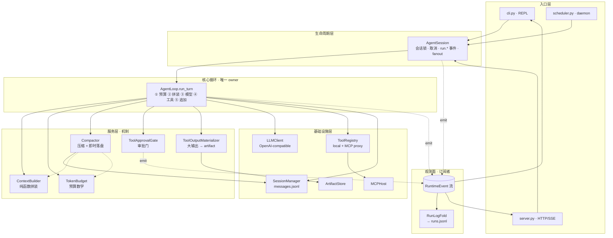
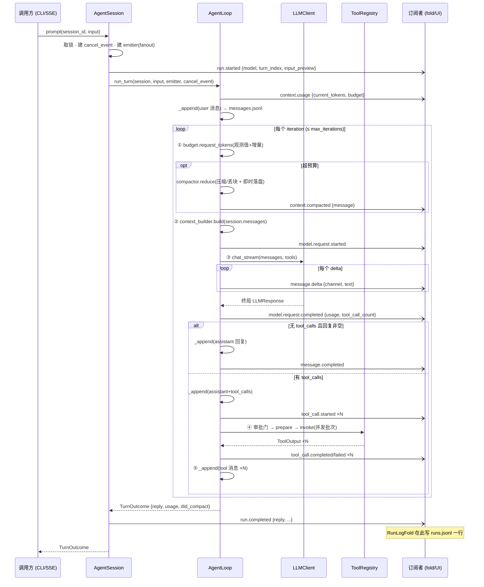
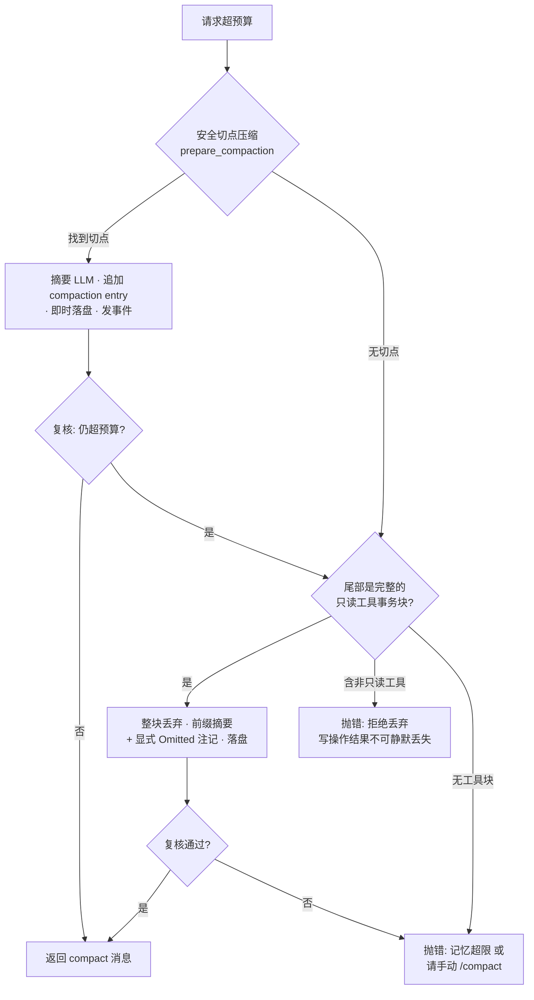

# Core 架构

本文是 MiniBot core runtime 的完整架构参考:组件分层、一次 turn 的时序、事件目录、预算与压缩、错误与并发语义。README 里的架构章节是它的摘要;设计取舍的论证(为什么长成这样)见 [core-philosophy.md](core-philosophy.md)。

对应代码版本:core 单一 owner 重构 + streaming(`message.delta`)之后的形状。

---

## 1. 分层总览



**依赖方向规则:**

- 循环 → 服务 → 基础设施,单向。任何服务不得反向持有循环或 `AgentSession` 的引用,也不通过回调够回调用方的状态。
- 服务层内部唯一的横向依赖是 `Compactor` 组合了 `ContextBuilder` 与 `TokenBudget`(压缩后要重估预算、复核是否回到预算内),这是声明过的例外。
- 事件流是单向出口:组件只 emit,不读事件;所有读方(CLI 渲染、SSE、run log)都在 runtime 之外订阅。

**组件职责表:**

| 组件 | 文件 | 职责 | 明确不做 |
|---|---|---|---|
| `AgentSession` | `runtime/agent_session.py` | run 生命周期:per-session 锁、per-run cancel event、`run.*` 事件、事件 fanout | 不碰消息内容、不做编排 |
| `AgentLoop` | `runtime/agent_loop.py` | 一个 turn 的全部编排;turn 状态(usage、compact 记录)只活在 `run_turn` 局部变量里 | 不实现任何机制 |
| `ContextBuilder` | `runtime/context_builder.py` | system prompt(base + memory + 时间 + skills 目录)+ 历史投影 → `BuiltRequest` | 零副作用:不调模型、不碰盘、不改 session |
| `TokenBudget` | `runtime/budget.py` | `input_budget`、全量/增量估算、超支报错文案 | 不决定何时压缩 |
| `Compactor` | `runtime/compactor.py` | 压缩机制:安全切点摘要、只读工具块丢弃;**变异 + 落盘在同一调用内完成** | 不决定何时触发(循环决定) |
| `ToolApprovalGate` | `runtime/approval.py` | 敏感工具放行/拒绝,emit `approval.*` | 不执行工具 |
| `ToolOutputMaterializer` | `runtime/tool_output_materializer.py` | >12k 字符的工具输出落盘为 artifact,模型只见引用+预览 | — |
| `RunLogFold` | `runtime/run_log_fold.py` | 订阅事件流,终止事件时把一个 run reduce 成 `runs.jsonl` 一行 | 永不让 run 失败(best-effort) |
| `SessionManager` | `session/store.py` | append-only 持久化、meta、跨进程文件锁 | — |
| `SessionContextProjector` | `session/models.py` | entries → 模型可见消息(摘要注入、不完整工具事务过滤) | — |

## 2. 一次 turn 的时序



要点:

- **上下文每轮重投影**(② 在循环内),不是 turn 开始拼一次。工具结果落盘后,下一轮的请求自然包含它们。
- `session.messages` 是投影缓存,`Session.add_message` 后自动重建;循环从不手工拼消息数组。
- `TurnOutcome` 是给调用方的便利返回值,不是第二条真相通道——它携带的每个字段都已经以事件形式发布过。

## 3. 事件目录

事件信封(`runtime/events.py`):`{id: "<run_id>:<seq>", run_id, session_id, seq, type, created_at, payload}`。seq 由 emitter 持锁单调递增,SSE 端用它做 `Last-Event-ID` 断点重放。

| 类型 | 发射点 | payload 关键字段 | 主要消费者 |
|---|---|---|---|
| `run.started` | AgentSession | `session_id` `input_preview` `model` `turn_index` | fold(开账)、UI 状态行 |
| `context.usage` | AgentLoop(turn 开始) | `current_tokens` `budget` | CLI verbose |
| `context.compacted` | AgentLoop(reduce 之后) | `iteration` `message` | CLI 提示、fold(`did_compact`) |
| `model.request.started` | AgentLoop | `iteration` `model` `input_preview` | CLI 状态行 |
| `model.request.completed` | AgentLoop | `iteration` `elapsed_ms` `tool_call_count` `usage`(本次调用);空回复时另有 `empty_reply` `response_debug` | fold(`llm_call_count`、usage 求和)、CLI |
| `message.delta` | AgentLoop(消费模型流时) | `iteration` `channel`(`text`/`reasoning`) `text` | CLI(text → 打字机;reasoning → 折叠式灰字预览)、web 流式气泡;**fold 与重放忽略** |
| `model.request.retrying` | AgentLoop(瞬时错误退避时) | `iteration` `attempt` `max_retries` `delay_seconds` `error_type` `message` | CLI 提示与状态行;fold 忽略 |
| `tool_call.started` | AgentLoop(计划阶段) | `tool_call_id` `tool` `display_name` `source` `args` `requires_approval` | CLI |
| `approval.required` | ToolApprovalGate | `approval_id` `tool_call_id` `tool` `args` | CLI 提问、web 审批端点 |
| `approval.resolved` | ToolApprovalGate | 同上 + `approved`,自动放行时 `auto: true` | CLI、web |
| `tool_call.completed` / `.failed` | AgentLoop(materialize 后) | `tool_call_id` `tool` `source` `ok` `code` `summary` `artifact` `truncated` | CLI、fold(工具/MCP 统计) |
| `message.completed` | AgentLoop | `iteration` `content`;达上限时 `reason: "max_iterations"` | CLI |
| `run.completed` | AgentSession | `reply` `did_compact` `compact_message` | fold(写 success 记录)、SSE 终止 |
| `run.failed` | AgentSession | `error_type` `message` | fold(写 failed 记录)、CLI |
| `run.cancelled` | AgentSession | `session_id` | fold(记为 failed/RunCancelled)、SSE 终止 |

**usage 求和语义**(fold 与循环内 `_merge_usage` 一致):不带 usage 的调用不污染总和;首个带 usage 的调用是基准;之后逐字段相加,任一字段缺失则该字段总和为 `None`。

**delta 的一等规则:delta 是尽力而为的视觉流,`message.completed` 才是权威全文。** 任何消费者必须在只收到 completed 时也能正确工作。由此推出:server 的 `RunEventStore` 把 `message.delta` 标记为 transient——广播给在线订阅者、不进重放 backlog,断线重连的客户端用 completed 的全文对齐;fold 对 delta 天然 no-op;usage 与 tool_calls 只挂在终局 `LLMResponse` 上(`LLMStreamEvent` 契约:零或多个 delta 后,恰好一个终局)。不支持流式的 provider 走 `chat_stream` 的默认实现(单终局事件),循环侧零分支;`MINIBOT_STREAMING=0` 可整体关闭。

## 4. 预算与压缩

预算:`input_budget = compact_token_threshold − reserved_completion_tokens`(默认 40000 − 4096)。

**增量估算**(热路径,`TokenBudget.request_tokens`):有上一轮真实 `input_tokens` 时,下一请求 ≈ 观测值 + 仅新增消息的估算。基线是 per-session 消息数,LRU 上限 512 个会话;基线缺失/倒退时退回全量估算。会话删除时经 `budget.forget(session_id)` 清基线(server 的 DELETE 端点已接)。

**超预算时 `Compactor.reduce` 的决策树:**



不变量:

- 压缩**只追加** compaction entry,原始消息永在 `messages.jsonl`;投影层负责"看起来变短了"。
- 切点永不落在 tool 结果上、永不切开未完成的工具事务(`runtime/compaction.py` 纯函数保证)。
- 增量摘要:新摘要在 `previous_summary` 基础上合并,read/modified 文件清单跨 compaction 累积(`<read-files>` / `<modified-files>` 区块)。
- 变异与落盘同调用完成(`Compactor._apply_compaction`),不存在待对账的中间态。

手动 `/compact` 走 `Compactor.compact_now`,只做一次安全切点压缩,无事可做时返回说明而不报错。

## 5. 错误与取消语义

**取消**:`AgentSession.abort(run_id)` 置位 cancel event,循环在这些检查点协作退出——每个 iteration 开头、模型流的每个 delta 之间、每个工具批次前、并行 future 的 50ms 轮询间隙、审批等待中、compaction 摘要调用前后。取消抛 `RunCancelled` → `run.cancelled` 事件 → fold 记 `failed / RunCancelled`。流中途取消时,循环在 `finally` 里 close 生成器,provider 的 `finally` 随之关闭底层 HTTP 流;半截文本不落盘。

**取消或崩溃留下的悬空 tool_calls**(assistant 带 tool_calls 但 tool 结果未落盘):投影层 `_filter_incomplete_tool_transactions` 在读取时整块过滤,保证下一轮请求永远合法。这是 append-only + 投影架构的直接收益。

**LLM 瞬时失败**:429/5xx/连接类错误按指数退避重试(默认 ≤3 次,`MINIBOT_LLM_MAX_RETRIES` 可调),每次重试发 `model.request.retrying` 事件;退避等待用 `cancel_event.wait` 实现,取消随时打断。**首个 delta 发出后不再重试**——文本已到达用户,静默重来会显示两遍。分类逻辑在 `llm.py` 的 `is_retryable_llm_error`(有 `status_code` 按码判断,连接/超时类天然瞬时)。重试耗尽或不可重试的异常直接向上抛,无包装;已消耗的 usage 不丢——它随每次 `model.request.completed` 事件即时离开循环,fold 手里已有累计值(这就是旧 `PartialRunError` 被删掉的原因)。

**摘要降级**:compaction 的摘要 LLM 调用失败时,`Compactor` 降级为"上一份摘要 + 失败注记 + 被压缩内容的截断原文"(尾部 2000 字符),压缩照常完成并落盘,`context.compacted` 消息附注"摘要降级为截断"。压缩失败永远不炸 turn。

**空回复**:发一条带 `empty_reply: true` + `response_debug` 的诊断事件,然后抛 `RuntimeError`。

**轮次上限**:追加一条道歉 assistant 消息、`message.completed(reason=max_iterations)`,正常返回(不是异常)。

**工具异常**:永远不炸循环——registry 层捕获为 `ToolOutput.failure`,审批 handler 崩溃降级为错误输出,并行批次中单个工具失败不影响同批其他工具。

**工具参数校验**:`registry.prepare` 先对照工具声明给模型的 JSON Schema 校验参数(`jsonschema`),违规返回带 `$.path` 定位的 `invalid_args`,让模型在执行前自我纠正;schema 本身畸形(部分 MCP server 会给宽松 schema)则跳过校验、退回签名绑定兜底。校验器按工具缓存编译。

**fold 的容错**:`RunLogFold` 整体 try/except,观测记账失败绝不反噬 run 本身。

## 6. 并发模型

- **run 级**:`AgentSession` 对每个 session 持一把非阻塞锁,同会话并发 prompt 直接抛 `SessionBusyError`;不同会话可并行(server 场景)。
- **工具级**:同一响应内,连续的 `concurrency_safe`(= `read_only` 且非 `exclusive`)工具组成并行批次,其余单个串行;批次内结果按模型请求顺序回填。executor 每个 run 惰性创建一个(上限 `max_parallel_tools`),`finally` 中 `shutdown(cancel_futures=True)`。
- **MCP**:asyncio 隔离在 `mcp_host` 的后台线程,对循环暴露同步接口;MCP 工具默认 `exclusive`,不进并行批次。
- **持久化**:`SessionManager` 用线程锁 + `fcntl` 文件锁保护读写,meta 原子写(临时文件 + `os.replace`)。状态全局化后,不同目录启动的 CLI/server 进程共享会话池与 `current_session` 指针;文件锁保证追加原子性,但 `AgentSession` 的会话锁是进程内的——同一会话被两个进程同时跑 turn 的防护目前只有文件层,单用户场景风险可接受,出现症状再加跨进程锁。
- **事件**:emitter 的 seq 分配持锁;`fanout` 同步顺序调用各订阅者,因此单个 run 内订阅者看到的事件顺序一致。

## 7. 持久化布局

**状态是全局的**(默认 `~/.minibot`,`MINIBOT_HOME` 覆盖)。设计原则:会话属于用户,不属于启动目录——**工作目录是"手"的范围(fs/exec 工具的根),不是"记忆"的地址**;它作为 provenance 元数据记录在会话 meta 里,供检索时过滤。

```
~/.minibot/                 # MINIBOT_HOME
├── sessions/<session_id>/
│   ├── messages.jsonl      # append-only entries: {type: message|compaction, ...}
│   ├── meta.json           # 标题、时间戳、workspace 来源、message_count(原子重写)
│   └── artifacts/          # 大工具输出,模型只持引用
├── runs.jsonl              # RunLogFold 产物,一行一个 run 摘要
├── locks/                  # per-session fcntl 锁文件
├── current_session         # 当前会话指针(全局:换目录接着聊)
├── user_memory.json        # 跨会话长期记忆
└── mcp.json                # 全局 MCP 配置(可选,优先于包内默认)
```

真相源只有 `messages.jsonl`;`session.messages`、`meta.json`、`runs.jsonl` 都是它或事件流的派生物。旧版散落的 `<workspace>/.minibot` 由 `minibot --migrate <dir>...` 一次性收编(id 冲突重命名并改写 meta、runs.jsonl 合并、回填 workspace 字段)。

**情景记忆**:`search_history` 工具对这份全局存储做 agentic search——关键词 AND 匹配消息原文与 compaction 摘要,支持 days / session / workspace 过滤,自动排除当前会话("现在"不是"历史")。不引入向量库:单用户规模下,对真相源的直接检索在透明度和新鲜度上优于预蒸馏管线;召回不足时再考虑本地嵌入(先用失败案例证明需求)。

## 8. 扩展点

| 想加什么 | 从哪进 |
|---|---|
| 新本地工具 | 实现 `Tool` ABC,注册进 `ToolRegistry`(声明 `read_only`/`exclusive`/`requires_approval`) |
| 新外部能力 | `mcp.json` 加一个 server,工具自动以 `mcp__<server>__<tool>` 挂载 |
| 新前端 | 订阅事件流 + 调 `AgentSession.prompt`,参照 `server.py` 的 `RunEventStore` |
| 新审批 UI | 提供 `ApprovalPolicy.handler`(CLI 是问答,web 是 `ApprovalBroker` 会合) |
| 新运行观测 | 写一个事件订阅者,`bootstrap.py` 的 `fanout` 里加一行,参照 `RunLogFold` |
| 新 LLM provider | 实现 `LLMClient.chat`;可选覆写 `chat_stream` 获得原生流式(不覆写则自动退化为单终局事件) |

刻意**没有**的扩展点:hook 管道。干预类扩展(改写请求/参数)目前只有审批一个真实需求,已作为显式依赖注入;出现第二个再设计通用接口,理由见 [core-philosophy.md](core-philosophy.md) §4。

## 9. 定时任务(主动性)

`scheduler.py` 是第三个入口层调用方——对 `AgentSession.prompt` 而言,daemon 和 CLI/server 没有区别,这是"headless run 本来就存在"的直接兑现。

- **存储**:`~/.minibot/schedule.json`(原子重写,线程锁 + fcntl,CLI 工具进程和 daemon 可并发读写)。任务两种:`cron`(手写的 5 字段子集:`*`、数字、逗号、区间、`/step`,dom/dow 双限定时按 vixie OR;本地时间求值)与 `once`(ISO 时间,naive 视为本地)。
- **触发**:`Scheduler.tick(now)` 是可测试单元——对每个任务算 `next_run`(锚点 = last_run 或 created),到期即触发;错过在 **1 小时宽限**内补跑,更久标记 `missed` 并顺延(避免长时间停机后的补跑风暴)。daemon 每 30s tick 一次,单实例由 `scheduler.pid.lock` 的 fcntl 非阻塞锁保证。
- **执行**:每次触发新建 `[定时] <标题> · <时间>` 会话(独立、可被 `search_history` 检索、不无限增长),prompt 前置"无人值守"声明。**审批默认全拒**——无人在场,`schedule_task` 工具本身则标记 `requires_approval`(创建未来的自主运行是敏感操作)。
- **投递**:成功/失败都发 macOS 通知(osascript,非 mac 静默跳过);完整结果在会话里。
- **agent 自排程**:`schedule_task` / `list_scheduled_tasks` / `cancel_scheduled_task` 三个工具,自然语言即可管理;CLI 侧 `/tasks` 查看与取消。
- 刻意不做:秒级精度(tick 30s,分钟粒度足够)、任务间依赖、失败重试(下个周期天然覆盖;LLM 层瞬时重试已存在)。
