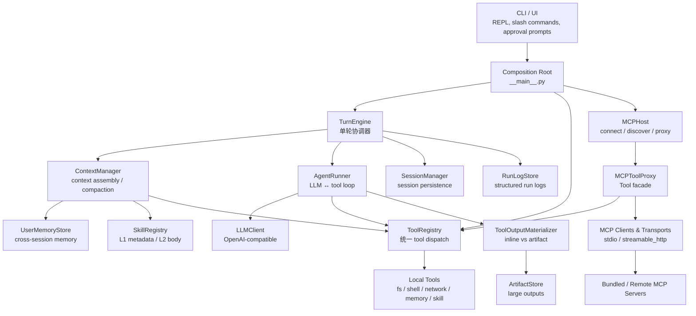
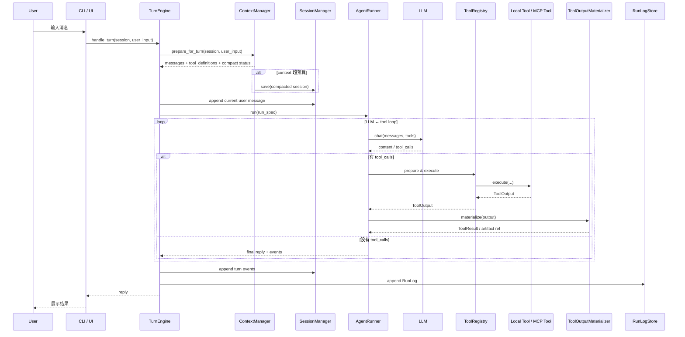
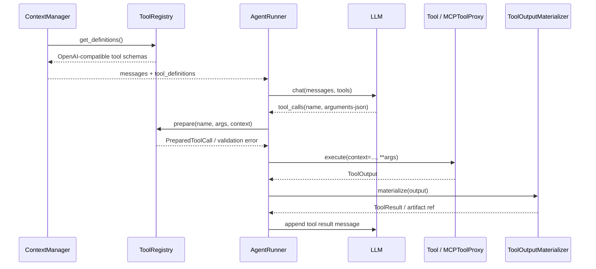
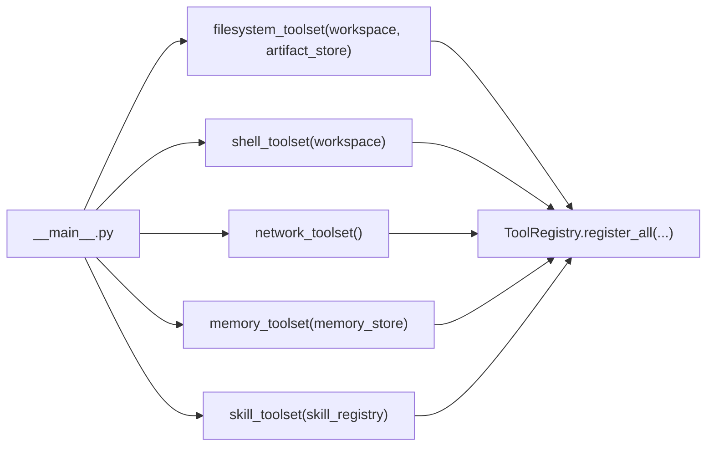
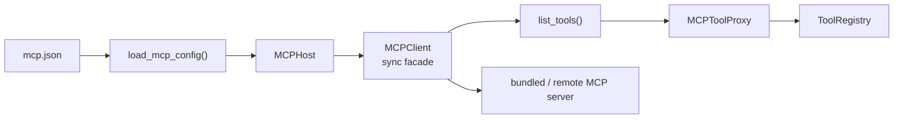

# MiniBot 项目面试稿（面向字节）

这份文档的目标不是“包装项目”，而是把简历上的 3 条内容拆成能经得住追问的技术叙述。原则只有两个：

- 只说代码里真实存在、自己能讲清楚的内容。
- 先讲问题和取舍，再讲术语和实现。

---

## 文档导读

这份文档按面试使用顺序分成 4 个部分：

1. **架构篇**
   先讲整体架构、模块边界和单轮数据流，解决“你这个系统整体怎么工作的”。
2. **高频深挖篇**
   重点准备 `tool call`、注册机制、MCP 接入以及它们背后的 Python 语言点。
3. **简历逐条展开**
   把你简历里的 3 条内容拆成可被追问的技术叙述。
4. **应答模板与边界**
   包括 1 分钟介绍、连续深挖回答顺序、数据口径、风险边界和最后可背的短句。

推荐阅读顺序：

1. 先看“架构篇”的 `单轮数据流` 和 `3 分钟架构开场稿`
2. 再看“高频深挖篇”的 `tool call / 注册 / MCP`
3. 然后看“简历逐条展开”
4. 最后看“应答模板与边界”

---

## 1. 项目一句话定位

MiniBot 是一个本地命令行 Agent runtime。它把 LLM、tool execution、session persistence、context management、memory、Skills 和 MCP 接入放在一个同步 turn loop 里统一调度。

更适合面试时说的版本：

> 这是一个本地 Agent 执行框架，不只是聊天壳子。核心目标是把模型调用、工具执行、上下文治理和外部能力接入做成一个稳定可持续运行的 runtime。

---

## 2. 架构篇

### 架构总览

如果面试官一上来就问“你先整体讲讲这个项目架构”，不要直接扎进某个模块。最稳的讲法是先抛出 4 个架构原则：

1. **同步 turn loop**
   整个 runtime 按“用户输入 -> 准备上下文 -> 模型/工具循环 -> 持久化”这一轮一轮推进，主控制流是同步的，便于调试和落日志。
2. **tool 统一抽象**
   不管是本地 tool 还是 MCP tool，最终都要注册进同一个 `ToolRegistry`，对上层暴露同构接口。
3. **context 先治理再请求**
   每轮先做 token 预算评估、必要时 compact，再把 memory、Skills、history 和 tool schema 组装成最终 request。
4. **运行期事件流 + 事后落盘分离**
   运行中通过 event handler 打实时日志；轮次结束后再把消息和 RunLog 落盘，兼顾在线调试和离线分析。

你先把这 4 句话讲出来，后面再展开模块，整体就不会散。

---

### 全局模块图



这张图你要讲清楚的核心不是“模块很多”，而是下面这句话：

> 整个系统其实只有一个主路径：`TurnEngine` 负责单轮编排，`ContextManager` 负责请求前的上下文治理，`AgentRunner` 负责模型和工具循环，其他模块本质上都是围绕这条主路径提供能力。

---

### 模块职责拆解

#### 1. Composition Root

对应文件：

- [__main__.py](/Users/jiminyang/Desktop/ai-projects/agent/minibot/__main__.py)

职责：

- 初始化配置、LLM、session、artifact、memory、run log
- 组装本地 tools
- 初始化 MCP Host 并注册 MCP tools
- 构造 `ContextManager`、`AgentRunner`、`TurnEngine`
- 启动 CLI/REPL

你可以这样讲：

> `__main__` 做的事情很像 dependency injection composition root。这里不做业务逻辑，只负责把 runtime 核心组件和依赖接起来。

#### 2. CLI / UI

对应文件：

- [cli.py](/Users/jiminyang/Desktop/ai-projects/agent/minibot/cli.py)
- [ui.py](/Users/jiminyang/Desktop/ai-projects/agent/minibot/ui.py)

职责：

- 读取用户输入
- 处理 slash commands，比如 `/sessions`、`/compact`、`/mcp`
- 展示运行日志、agent 回复和审批提示

这里的关键词不是“前端”，而是“控制台交互层”。

#### 3. TurnEngine

对应文件：

- [runtime/turn_engine.py](/Users/jiminyang/Desktop/ai-projects/agent/minibot/runtime/turn_engine.py)

职责：

- 处理一整轮 user turn
- 调用 `ContextManager` 准备请求
- 调用 `AgentRunner` 跑模型/工具循环
- 负责 session message append、metadata update、RunLog append

这层是系统真正的“单轮事务边界”。

可以这样讲：

> 如果把整个系统类比成 Web 服务，`TurnEngine` 很像 request orchestrator。它自己不做推理、不做工具细节，只负责把这一轮的输入、执行和落盘串起来。

#### 4. ContextManager

对应文件：

- [runtime/context_manager.py](/Users/jiminyang/Desktop/ai-projects/agent/minibot/runtime/context_manager.py)

职责：

- 组装最终 system prompt
- 渲染长期 memory
- 渲染 Skills 的 L1 metadata
- 拼接 history 和 tool definitions
- 在超预算时触发 compaction

这层回答的是：

> “这一轮到底要把什么上下文发给模型？”

#### 5. AgentRunner

对应文件：

- [runtime/agent_runner.py](/Users/jiminyang/Desktop/ai-projects/agent/minibot/runtime/agent_runner.py)

职责：

- 执行 LLM ↔ tool loop
- 解析模型返回的 tool calls
- 批量/并发执行满足条件的 tools
- 处理审批
- 将 tool output materialize 成模型可继续消费的结果

这层回答的是：

> “模型发起 tool call 之后，这一轮怎么继续往前走？”

#### 6. ToolRegistry + Tools

对应文件：

- [tools/base.py](/Users/jiminyang/Desktop/ai-projects/agent/minibot/tools/base.py)
- [tools/registry.py](/Users/jiminyang/Desktop/ai-projects/agent/minibot/tools/registry.py)
- [tools/__init__.py](/Users/jiminyang/Desktop/ai-projects/agent/minibot/tools/__init__.py)

职责：

- 维护统一 tool 抽象
- 暴露工具 schema
- 按名称 prepare / invoke / execute
- 屏蔽本地 tool 和 MCP tool 的差异

系统里很多“稳定性”其实都建立在这层抽象之上。

#### 7. MCP Host

对应文件：

- [mcp_host/host.py](/Users/jiminyang/Desktop/ai-projects/agent/minibot/mcp_host/host.py)
- [mcp_host/provider.py](/Users/jiminyang/Desktop/ai-projects/agent/minibot/mcp_host/provider.py)

职责：

- 加载 `mcp.json`
- 连接 enabled servers
- 做 tool discovery
- 生成 `MCPToolProxy`
- 维护 server 级状态和失败隔离

你可以这么讲：

> MCP Host 本质上是外部能力接入层，不直接参与单轮调度，但它决定了远端能力如何被同构地引入到 `ToolRegistry`。

#### 8. 持久化层

对应文件：

- [session/store.py](/Users/jiminyang/Desktop/ai-projects/agent/minibot/session/store.py)
- [run_log.py](/Users/jiminyang/Desktop/ai-projects/agent/minibot/run_log.py)
- [artifacts.py](/Users/jiminyang/Desktop/ai-projects/agent/minibot/artifacts.py)
- [user_memory.py](/Users/jiminyang/Desktop/ai-projects/agent/minibot/user_memory.py)

职责：

- session messages 按 JSONL append
- run summary 按 JSONL append
- 大结果单独落 artifact
- 跨会话 memory 独立存储

这层不要讲成“数据库设计”，因为本项目不是 DB-heavy 系统，它更像轻量但边界清晰的本地状态管理。

---

### 单轮数据流

这是你面试里最该讲熟的部分，因为它能把所有模块串起来。



这张图讲的时候建议直接按 6 步说：

1. 用户输入先进入 `TurnEngine`
2. `ContextManager` 在请求前准备上下文并决定是否 compact
3. 当前用户消息先落 session
4. `AgentRunner` 执行模型和工具循环
5. 这一轮产生的 assistant/tool events 追加写入 session
6. `RunLogStore` 记录结构化摘要，CLI 再把结果展示给用户

这 6 步一讲，整体架构就立住了。

---

## 3. 高频深挖篇

### 面试官高概率深挖的 4 条线

你判断得对。对于这个项目，字节一面更可能抓住下面 4 条线往下问，而不是泛泛听你讲“做了个 Agent”：

1. `tool call` 怎么设计的，模型和 tool 怎么交互
2. tool 怎么注册，为什么这样注册
3. MCP 怎么接入、怎么注册、怎么隔离
4. 这些设计背后用了哪些 Python 机制，为什么这么写

你后面回答时，建议就按这 4 条线组织，不要散讲。

---

### 高频线 1：tool call 怎么设计

这是最核心的一条，因为它直接决定 Agent 和 tool 的交互边界。

#### 一句话回答

> 我的 tool call 设计分成 3 层：
> 第一层是给模型看的 tool schema；
> 第二层是运行时内部的统一 `Tool` 抽象和注册表；
> 第三层是 `AgentRunner` 里的 LLM ↔ tool loop。
> 模型只负责产生命名和参数，真正的参数校验、审批、并发控制和结果物化都在 runtime 里完成。

#### 你要讲清楚的核心边界

##### 模型负责什么

- 决定要不要调用 tool
- 输出 `tool_call.name`
- 输出 JSON 字符串形式的 `tool_call.arguments`

##### runtime 负责什么

- 暴露 tool definitions 给模型
- 解析参数
- 根据名字查找 tool
- 做参数校验
- 做审批和并发控制
- 执行 tool
- 将结果整理成模型下一轮能继续消费的消息

这个边界一定要讲清楚，因为它体现的是“模型只提意图，runtime 掌控执行”。

#### tool call 全链路图



#### 具体是怎么做的

##### 1. 给模型的 tool schema

对应文件：

- [tools/base.py](/Users/jiminyang/Desktop/ai-projects/agent/minibot/tools/base.py)
- [tools/registry.py](/Users/jiminyang/Desktop/ai-projects/agent/minibot/tools/registry.py)
- [runtime/context_manager.py](/Users/jiminyang/Desktop/ai-projects/agent/minibot/runtime/context_manager.py)

机制是：

- 每个 tool 自己声明 `parameters`
- `Tool.to_definition()` 转成 OpenAI-compatible tool definition
- `ToolRegistry.get_definitions()` 收集所有 schema
- `ContextManager` 在 build request 时把这些 schema 带给模型

标准说法：

> 模型看到的不是 Python 函数本身，而是运行时导出的 tool schema。这样模型只知道“有哪些能力”和“参数长什么样”，不接触具体实现细节。

##### 2. 运行时怎么执行 tool call

对应文件：

- [runtime/agent_runner.py](/Users/jiminyang/Desktop/ai-projects/agent/minibot/runtime/agent_runner.py)
- [tools/registry.py](/Users/jiminyang/Desktop/ai-projects/agent/minibot/tools/registry.py)

关键流程：

- `AgentRunner` 从 LLM response 里取出 `tool_calls`
- 用 `_parse_args()` 把 arguments JSON 字符串转成 `dict`
- 进入 `ToolRegistry.prepare()`
- `prepare()` 做 3 件事：
  - 检查参数是不是 dict
  - 检查 tool 名字是否存在
  - 用 `inspect.signature(...).bind(...)` 做签名级参数校验
- 校验通过才会得到 `PreparedToolCall`
- `invoke()` 才真正执行 tool

这里最好强调 `prepare / invoke` 分离：

> 我把“校验”和“执行”拆成了两步。这样审批、并发调度、错误处理都可以发生在真正执行之前，不会把验证逻辑揉进每个 tool 实现里。

##### 3. 为什么 tool 返回值也要统一

对应文件：

- [tools/result.py](/Users/jiminyang/Desktop/ai-projects/agent/minibot/tools/result.py)
- [runtime/tool_output_materializer.py](/Users/jiminyang/Desktop/ai-projects/agent/minibot/runtime/tool_output_materializer.py)

Tool 不是直接回字符串，而是统一回 `ToolOutput`：

- `ok`
- `code`
- `summary`
- `data`
- `content`
- `meta`

为什么要这样：

- 模型下一轮更稳定
- runtime 能统一处理错误码
- 大结果可以 materialize 成 artifact
- 不同 tool 的输出格式不会把主循环搞碎

#### Agent 和 tool 到底怎么交互

这题可以直接这么答：

> Agent 和 tool 的交互不是“模型直接调用 Python 函数”，而是走消息驱动。模型先返回一个结构化 `tool_call`，runtime 根据名字去注册表里找到 tool，执行完以后再把 tool result 作为一条 `role=tool` 的消息塞回对话历史，让模型继续推理。

这个回答很关键，因为它说明你理解的是“协议式交互”，不是“函数式调用”。

#### 面试官可能追问

##### Q1：为什么不让 tool 自己直接操作 history？

标准回答：

> 因为 history 是会话状态，不应该由具体 tool 直接修改。tool 只负责产出语义结果，history 的写入由 `AgentRunner/TurnEngine` 统一控制，这样状态边界更清晰。

##### Q2：为什么不用动态反射直接执行函数？

标准回答：

> 直接反射调用会让参数校验、权限控制、日志和并发语义分散到各个地方。我用统一 `Tool` 抽象和注册表，就是为了把运行时控制点收敛起来。

##### Q3：为什么 tool result 要分 `summary` 和 `content`？

标准回答：

> 因为模型不一定每次都需要完整正文。`summary` 给短语义，`content` 给正文，大结果还可以落盘成 artifact，这样上下文和结果存储才能解耦。

---

### 高频线 2：tool 怎么注册，为什么这样注册

这一块别讲成“我就是 new 了几个对象”。要讲“为什么不用注解/装饰器自动注册，而是显式 composition root”。

#### 一句话回答

> 我用的是显式注册，不是 decorator auto-registration。原因是大多数 tool 都需要运行时依赖，比如 `workspace`、`ArtifactStore`、`UserMemoryStore`、`SkillRegistry`，这些依赖更适合在 composition root 里显式注入，而不是靠隐式扫描。

#### 注册机制图



#### 具体怎么做

对应文件：

- [tools/__init__.py](/Users/jiminyang/Desktop/ai-projects/agent/minibot/tools/__init__.py)
- [__main__.py](/Users/jiminyang/Desktop/ai-projects/agent/minibot/__main__.py)
- [tools/registry.py](/Users/jiminyang/Desktop/ai-projects/agent/minibot/tools/registry.py)

设计是：

- 不做全局扫描
- 用 `toolset factory` 返回一组 `Tool`
- 在 `__main__` 里实例化依赖
- 再统一 `register_all`

这个设计的价值：

- 依赖来源明确
- 测试时好替换
- tool 按能力域分组
- 不依赖 import side effects

#### 为什么不用 decorator 注册

这是典型 Python 面试延展题。

标准回答：

> decorator 注册的优点是写起来短，但缺点是依赖来源隐蔽，而且容易产生 import order 和 side effect 问题。这个项目里的工具很多都依赖 runtime 对象，比如 workspace、artifact store、memory store，所以我更倾向于显式实例化 + 显式注册。

你还可以再补一句：

> 如果是纯静态无状态工具，decorator 注册也可以。但在这个项目里，构造期依赖比注册动作本身更重要。

#### prepare / invoke 分层也是注册机制的一部分

你可以这样理解：

- `register`：把能力挂进 registry
- `prepare`：把一次调用变成已验证的调用对象
- `invoke`：执行已验证调用

这三层拆开以后，你的 runtime 就有很好的控制点。

#### 面试官可能追问

##### Q1：为什么不用 dict[str, Callable] 就结束？

标准回答：

> 如果只是做 demo，`dict[str, Callable]` 够了。但这个项目还需要参数 schema、审批、并发语义、source 区分、本地/MCP 同构、结构化返回值，这些信息靠普通函数映射承载不了，所以我抽成了 `Tool` 对象。

##### Q2：为什么 `ToolRegistry` 不直接执行而要 `prepare`？

标准回答：

> 因为 prepare 阶段适合做名字检查、签名绑定和调用对象构建，这些逻辑应该在执行前完成。这样执行器就能先批量规划，再决定审批和并发策略。

##### Q3：注册冲突怎么处理？

标准回答：

> 本地 tool 这层默认后注册覆盖前注册，但 MCP 接入时我额外做了冲突检测，如果 registry 里已有同名工具会直接跳过并打日志，避免远端能力把已有能力静默覆盖掉。

---

### 高频线 3：MCP 怎么设计、怎么接入、怎么注册

#### 一句话回答

> MCP 在我这里是一个 capability integration layer。它不直接参与主循环决策，而是负责把外部能力发现出来，并包装成和本地 tool 同构的 `MCPToolProxy`，最后注册进同一个 `ToolRegistry`。

#### MCP 接入图



#### 具体接入过程

##### 1. 配置加载

对应文件：

- [mcp_host/config.py](/Users/jiminyang/Desktop/ai-projects/agent/minibot/mcp_host/config.py)
- [mcp_host/models.py](/Users/jiminyang/Desktop/ai-projects/agent/minibot/mcp_host/models.py)

这里的点要讲清楚：

- `mcp.json` 是 repo-local 配置
- 配置被 parse 成 `MCPServerConfig`
- transport 是一个 tagged union：
  - `StdioTransportConfig`
  - `StreamableHTTPTransportConfig`
- 支持 `${ENV_VAR}` 替换

这其实就已经能引出 Python 的 `dataclass + Literal + union type` 了。

##### 2. host 连接和发现

对应文件：

- [mcp_host/host.py](/Users/jiminyang/Desktop/ai-projects/agent/minibot/mcp_host/host.py)

流程：

- `MCPHost.from_workspace()` 读取配置
- `connect_all()` 遍历 enabled servers
- 每个 server 创建一个对应 transport client
- `client.connect()` 建立 session 并拉取 tool catalog
- 每个 discovered tool 转成 `MCPToolProxy`

这里一定要讲一句：

> MCP Host 不是简单保存配置，而是在启动阶段完成连接和 tool discovery，所以后续主循环看到的是已经注册好的可调用工具。

##### 3. 怎么注册成 tool

对应文件：

- [mcp_host/provider.py](/Users/jiminyang/Desktop/ai-projects/agent/minibot/mcp_host/provider.py)
- [__main__.py](/Users/jiminyang/Desktop/ai-projects/agent/minibot/__main__.py)

机制是：

- 每个远端 tool 会生成一个 `MCPToolProxy`
- `MCPToolProxy` 继承 `Tool`
- 它的 `parameters` 直接暴露 MCP 返回的 `input_schema`
- `execute()` 内部转发给 `client.call_tool(...)`
- 然后像本地工具一样 `tool_registry.register(proxy)`

关键点就是这句：

> 注册不是“单独搞一套 MCP registry”，而是把 MCP tool 包成普通 `Tool` 后注册进同一个 `ToolRegistry`。

##### 4. namespacing 和隔离

命名格式：

`mcp__<server_name>__<remote_tool_name>`

价值：

- 防止和本地工具重名
- 防止不同 server 的 `query/search/run` 冲突
- 日志可读

隔离是 server 级别的：

- 某个 server 初始化失败，只更新它自己的 status
- 其他 server 继续接入
- 本地 tools 不受影响
- 调用时如果连接异常，会尝试重连一次

#### 为什么 MCP client 对上层是同步的

这个问题非常可能会被问。

标准回答：

> MCP transport 底层是异步 session，但我的主 turn loop 是同步的。为了不把整个系统 async 化，我在 transport 层做了 sync facade：每个 server 维护一个后台 event loop thread，上层通过同步接口 `connect/list_tools/call_tool/close` 使用它。

这里对应文件：

- [mcp_host/client.py](/Users/jiminyang/Desktop/ai-projects/agent/minibot/mcp_host/client.py)
- [mcp_host/transport/base.py](/Users/jiminyang/Desktop/ai-projects/agent/minibot/mcp_host/transport/base.py)

#### 面试官可能追问

##### Q1：为什么不直接在 AgentRunner 里接 MCP SDK？

标准回答：

> 因为那样主循环就会依赖 transport 和 provider 细节。我的目标是让主循环只认 `Tool` 接口，MCP 的连接、发现、重连和 schema 转换都应该收敛在 host/provider 这一层。

##### Q2：MCP tool 为什么默认 `exclusive`？

标准回答：

> 因为远端 tool 的副作用、限流和时延我无法像本地只读工具那样准确判断，所以默认保守处理，避免并发把问题扩大。

##### Q3：为什么要做 sync facade，而不是全系统 async？

标准回答：

> 因为这个项目主要是 turn-based orchestration，不是高吞吐并发服务。全系统 async 会把复杂度扩散到每个模块；我只把异步限制在 transport 内部，收益和复杂度更平衡。

---

### 高频线 4：这些设计背后的 Python 知识点

你要准备的不是背语法，而是能说明“为什么这里用这个 Python 机制”。

#### 1. 依赖注入

这个项目不是 Spring 那种 IoC 容器，而是 **显式 constructor injection + composition root**。

对应点：

- `__main__.py` 统一实例化依赖
- `toolset factory` 接收依赖并返回工具对象
- `ContextManager / AgentRunner / TurnEngine` 都通过构造函数拿依赖

标准回答：

> 我用的是显式依赖注入，不是框架式 IoC。这样依赖关系在 composition root 很清楚，也更利于测试替换。

#### 2. 抽象基类和 property

对应文件：

- [tools/base.py](/Users/jiminyang/Desktop/ai-projects/agent/minibot/tools/base.py)

用到了：

- `ABC`
- `@abstractmethod`
- `@property`

为什么这样写：

- `name/description/parameters` 更像声明式属性，不像普通方法
- 子类必须实现这些接口

标准回答：

> `Tool` 用抽象基类而不是鸭子类型，是因为这里不仅要约束 execute，还要约束 schema 和运行时属性；`@property` 让这些能力描述看起来像元数据，而不是普通行为方法。

#### 3. Protocol

对应文件：

- [mcp_host/client.py](/Users/jiminyang/Desktop/ai-projects/agent/minibot/mcp_host/client.py)

用 `Protocol` 定义了 `MCPClient` 接口。

为什么不是继承基类：

- 这里主要需要的是结构约束
- 不想把 transport client 强耦合到继承树上

标准回答：

> `Protocol` 更适合表达“只要有这些方法就能被当成 MCPClient 使用”的结构化接口，对 transport 层更灵活。

#### 4. dataclass(frozen=True)

对应文件：

- [mcp_host/models.py](/Users/jiminyang/Desktop/ai-projects/agent/minibot/mcp_host/models.py)
- [run_log.py](/Users/jiminyang/Desktop/ai-projects/agent/minibot/run_log.py)

为什么用：

- 配置对象和记录对象偏数据载体
- `frozen=True` 可以减少误修改

标准回答：

> 这类对象的职责是承载配置和结果，而不是封装复杂行为，所以我用 `dataclass`。`frozen=True` 让它们更接近不可变值对象，调试时更稳。

#### 5. 类型标注 / Literal / TypeAlias / Union

对应文件：

- [mcp_host/models.py](/Users/jiminyang/Desktop/ai-projects/agent/minibot/mcp_host/models.py)

这块很适合被追问。

为什么用：

- `TransportType = Literal["streamable_http", "stdio"]`
- transport config 是 tagged union

价值：

- 配置分支更明确
- IDE 和静态检查更友好

#### 6. TYPE_CHECKING

这个项目里多处用了 `if TYPE_CHECKING:`

作用：

- 避免运行时循环 import
- 只在类型检查阶段导入重对象

标准回答：

> 我在类型标注需要引用但运行时不必导入的地方使用 `TYPE_CHECKING`，这是为了减少循环依赖和启动时不必要的导入成本。

#### 7. 高阶函数 / callback

对应点：

- `event_handler`
- `approval_handler`

为什么好用：

- 业务逻辑不依赖具体 UI
- 同一套 runtime 可以接 CLI、structured logger、测试 stub

标准回答：

> 事件输出和审批我都做成 callback 注入，这样核心 runtime 不依赖具体展示层或交互层，是一种很轻量的解耦方式。

#### 8. 并发和异步

对应点：

- `ThreadPoolExecutor` 跑 read-only tools
- 每个 MCP server 一个后台 event loop thread
- `asyncio.run_coroutine_threadsafe(...)` 做 sync/async bridge
- `AsyncExitStack` 统一管理异步资源生命周期

标准回答：

> 本地只读 tools 的并发我用线程池，因为它们主要是 I/O bound；MCP 这边底层是 async session，但我不想把主循环 async 化，所以用后台 event loop 线程做桥接。

#### 9. deepcopy 和防御式编程

对应文件：

- [mcp_host/provider.py](/Users/jiminyang/Desktop/ai-projects/agent/minibot/mcp_host/provider.py)

`MCPToolProxy.parameters` 返回 `deepcopy(input_schema)`。

为什么：

- 防止上层调用方意外修改底层发现得到的 schema

这类点不大，但很适合体现你写代码时的边界意识。

---

### 连续追问时的回答顺序

1. 先讲 `tool call` 是消息驱动，不是直接函数调用
2. 再讲 `ToolRegistry` 是统一中间层，不是普通字典
3. 再讲 tool 注册是显式依赖注入，不是 decorator 扫描
4. 再讲 MCP 是 capability integration layer，最后也注册成普通 `Tool`
5. 最后再落到 Python：ABC、Protocol、dataclass、callback、线程池、event loop bridge

这个顺序的好处是：

- 先讲系统设计
- 再讲实现边界
- 最后自然过渡到语言细节

这样你就不会被带着只聊语法。

---

### 三条核心技术链路

你可以把系统拆成 3 条主链路去讲，这样更像架构师在讲系统，而不是在背模块名。

#### 1. Tool 链路

`LLM -> ToolRegistry -> Local Tool / MCPToolProxy -> ToolOutput -> ToolResult`

这一条解决的问题是：

- tool 如何被统一描述
- tool 如何被安全调度
- tool 返回值如何被 runtime 稳定消费

你可以总结成一句话：

> Tool 链路解决的是“能力如何标准化暴露给模型”。

#### 2. Context 链路

`Session + Memory + Skills + Tool Schemas -> ContextManager -> Prepared Request`

这一条解决的问题是：

- 该给模型什么上下文
- 上下文超预算怎么办
- 大结果如何不污染 prompt

一句话总结：

> Context 链路解决的是“每一轮该让模型看到什么”。

#### 3. Capability 接入链路

`mcp.json -> MCPHost -> Transport Client -> MCPToolProxy -> ToolRegistry`

这一条解决的问题是：

- 外部能力如何接入
- 本地和远端能力如何统一
- 单个远端失败如何隔离

一句话总结：

> MCP 链路解决的是“外部能力如何以统一协议进入 runtime”。

---

### 为什么主循环是同步的

这是很可能被问到的架构问题。

标准回答：

> 我刻意把主 turn loop 设计成同步的，因为这个系统的核心边界是“一轮用户输入”的编排，而不是高吞吐并发请求。同步控制流更容易保证可读性、日志顺序和错误恢复。
> 只有 MCP transport 底层是异步的，我把这部分封装进独立后台 event loop thread，对上层暴露同步接口，避免整个 runtime async 化。

这个回答里一定要有两层：

- 主控制流同步
- 局部异步需求被包进 transport 内部

这样显得你是主动取舍，不是“不会写 async”。

---

### 为什么本地 tool 和 MCP tool 要同构

这也是架构层最有价值的一点。

标准回答：

> 因为如果主循环要区分“这个是本地工具，那套逻辑；那个是远端工具，这套逻辑”，系统会越来越碎。我的做法是把 MCP tool 包成 `MCPToolProxy`，最终还是一个 `Tool`，这样审批、日志、错误处理、materialization 都能复用一套路径。

你可以顺手补一句：

> 这也是我为什么强调 `ToolRegistry` 是系统中间层，而不是简单 list of functions。

---

### 存储布局和状态边界

这个部分讲清楚之后，面试官会感觉你对系统状态边界比较敏感。

#### 本地状态布局

```text
<workspace>/.minibot/
├── current_session
├── runs.jsonl
└── sessions/
    └── <session_id>/
        ├── meta.json
        ├── messages.jsonl
        └── artifacts/

~/.minibot/
└── user_memory.json
```

#### 设计含义

- `session` 是 workspace-scoped 的，对话和 artifact 跟当前项目目录绑定
- `user_memory` 是 cross-session、global 的，不绑定某个 workspace
- `runs.jsonl` 记录的是一轮执行摘要，不是完整消息历史
- `messages.jsonl` 是事实来源，resume 时从这里恢复

标准讲法：

> 我把 session state、run summary 和 long-term memory 明确拆开了。session 解决当前项目里的连续对话，RunLog 解决离线分析，memory 解决跨会话稳定用户事实，这三种状态语义不一样，所以不能混存。

---

### 3 分钟架构开场稿

下面这段建议你单独练熟。

> 这个项目整体上是一个本地 Agent runtime，我把它拆成三个核心层次。
> 第一层是单轮编排层，核心是 `TurnEngine`。用户输入进来以后，它先调用 `ContextManager` 组装这一轮请求需要的 system prompt、history、memory、Skills 和 tool schemas，如果 token 超预算就先 compact；然后再交给 `AgentRunner` 跑模型和工具循环，结束后把消息和 RunLog 持久化。
> 第二层是能力执行层，核心是 `ToolRegistry` 和 `AgentRunner`。我把本地 tools 和 MCP tools 都抽象成统一 `Tool` 接口，并给 tool 定义 structured result schema 以及并发安全属性。这样主循环可以统一处理 tool dispatch、approval、错误码和大结果 materialization。
> 第三层是外部能力接入层，核心是 `MCPHost`。它负责读取配置、连接 server、发现工具，并把远端能力包装成 `MCPToolProxy` 注册进 `ToolRegistry`。这样对上层来说，本地 tools 和 MCP tools 没有本质差别。
> 整个架构里我最关注的是三个问题：tool 如何统一、context 如何治理、外部能力如何标准化接入。后面简历上的三条其实分别对应这三个问题。

这段的价值是：

- 先讲“分层”
- 再讲“主路径”
- 最后把它和你的 3 条简历 bullet 对齐

---

### 面试时怎么从架构自然切到 3 个亮点

不要突然说“然后我做了 A、B、C”。推荐这个过渡句：

> 如果按技术问题拆，我这个项目主要解决了 3 件事：
> 第一是 tool layer 的统一抽象和安全执行；
> 第二是 Agent 场景下的 context governance；
> 第三是通过 MCP 做外部能力接入和隔离。
> 我简历上的 3 条就是分别在讲这 3 件事。

这个转场非常重要，它能让你从“架构图讲解”平滑切回简历 bullet。

---

## 4. 简历逐条展开

### 简历 3 条的标准展开

下面按你简历里的 3 条写法展开，每条都分成：

- 我到底做了什么
- 为什么要这样做
- 关键实现
- 面试官可能继续追问什么

---

### Bullet 1

#### 简历写法

Designed a unified local tool framework with a structured result schema and concurrency-safety controls, enabling safe parallel execution of four read-only tools and reducing median latency by 75% in benchmarks.

#### 面试时你应该先讲什么

这一条的重点不是“我写了很多工具”，而是“我把工具从零散函数抽象成了统一运行时接口，并且明确了哪些工具能并发、哪些不能并发”。

如果面试官让你展开，建议按这个顺序说：

1. Agent 项目里最容易失控的是 tool layer。
2. 如果每个 tool 的入参、返回值、并发语义都不一样，主循环会很快变脆。
3. 所以我先做了统一抽象，再在抽象层表达并发和安全边界。

#### 我到底做了什么

- 给所有本地工具定义了统一的 `Tool` 接口，包括 `name`、`description`、`parameters`、`execute()`。
- 用 `ToolRegistry` 统一注册和调度工具，对模型暴露统一的 JSON Schema。
- 给工具返回值定义了结构化结果 schema，不让 tool 随便返回裸字符串。
- 在工具抽象层定义了并发相关属性：`read_only`、`exclusive`、`requires_approval`，再推导出 `concurrency_safe`。
- 在 `AgentRunner` 里按批次执行 tool calls：只读且非独占的工具允许并发，写操作、审批操作、MCP 操作按串行或单独执行。

#### 为什么这样设计

核心问题有两个：

1. `tool result` 如果没有统一 schema，模型侧很难稳定消费。
2. tool 并发如果没有明确边界，最容易出现状态冲突、覆盖写入、审批绕过和调试困难。

所以我的设计思路是：

- 先统一协议，再谈能力扩展。
- 先让并发语义可表达，再让执行器决定是否并发。

#### 关键实现

##### 1. 统一 Tool 抽象

对应文件：

- [tools/base.py](/Users/jiminyang/Desktop/ai-projects/agent/minibot/tools/base.py)
- [tools/registry.py](/Users/jiminyang/Desktop/ai-projects/agent/minibot/tools/registry.py)

可以这样讲：

> 我没有把工具当成普通函数直接给模型调用，而是做了一层 `Tool` 抽象。每个 tool 都要声明参数 schema、执行方法和运行时属性，主循环只依赖这层协议，不依赖具体工具类型。

##### 2. 结构化结果 schema

对应文件：

- [tools/result.py](/Users/jiminyang/Desktop/ai-projects/agent/minibot/tools/result.py)
- [runtime/tool_output_materializer.py](/Users/jiminyang/Desktop/ai-projects/agent/minibot/runtime/tool_output_materializer.py)

这里一定要讲清楚两层对象：

- `ToolOutput`：tool 原始语义结果
- `ToolResult`：runtime materialize 之后真正返回给模型的结果

你可以这么说：

> 我没有让工具直接返回字符串，而是要求工具返回统一的 `ok/code/summary/data/content/meta` 结构。这样主循环才能稳定处理错误、截断、大结果落盘和 artifact 引用，不会因为某个工具格式特殊而写很多 if/else。

这里的关键价值：

- `summary` 给模型短摘要
- `data` 保留结构化字段
- `content` 存正文，大结果可落盘
- `code` 区分 `success/conflict/invalid_args/denied/error` 等状态

##### 3. 并发安全控制

对应文件：

- [tools/base.py](/Users/jiminyang/Desktop/ai-projects/agent/minibot/tools/base.py)
- [runtime/agent_runner.py](/Users/jiminyang/Desktop/ai-projects/agent/minibot/runtime/agent_runner.py)

并发控制不是复杂调度器，而是“属性驱动的批处理”：

- `read_only=True` 且 `exclusive=False` 的工具才算 `concurrency_safe`
- `max_parallel_tools` 控制并发上限
- 非并发安全的工具会拆成单独 batch 执行

建议这样回答：

> 我没有做一个复杂的 DAG 调度器，而是先把问题收敛成批处理：只读工具并发，写工具和敏感工具串行。这个策略足够简单，也覆盖了本项目最核心的正确性要求。

#### benchmark 数据怎么来的

这是你最容易被问的地方，必须能完整复述：

- 我写了 4 个 dummy read-only tools，每个执行逻辑是 `sleep 80ms`
- 用 `AgentRunner` 分别跑 `max_parallel_tools=1` 和 `max_parallel_tools=4`
- 每组执行 5 次，取中位数
- 结果是 `336.2ms -> 85.7ms`，下降 `74.5%`

这里要主动补一句：

> 这个数据是本地 synthetic benchmark，不是线上生产流量数据，所以我简历里写的是 in benchmarks，而不是在线上场景下。

#### 面试官可能继续追问

##### Q1：为什么不默认全部并发？

标准回答：

> 因为 Agent 的 tool 不只是读操作，还包括写文件、审批、MCP 远程调用。默认全并发会把状态竞争和错误恢复复杂度一下子拉高。我的做法是先把并发限制在 read-only、non-exclusive 这类低风险工具上，用最小复杂度换取确定收益。

##### Q2：为什么不做依赖分析或 DAG？

标准回答：

> 这个项目里大多数 tool call 是模型在单轮内顺序生成的，而且工具之间的依赖关系不稳定。做 DAG 的前提是依赖信息显式可得，但这里依赖是隐式存在于模型推理里的，所以我优先做了基于工具属性的批处理，而不是复杂调度器。

##### Q3：structured result schema 的核心价值是什么？

标准回答：

> 核心价值是把“工具成功/失败/正文/摘要/结构化字段”拆开。这样一方面模型更容易消费，另一方面 runtime 才能插入 artifact materialization、错误码处理和日志持久化。

#### 这一条别说什么

- 不要说“我实现了通用多 Agent 调度框架”，你没有。
- 不要说“并发调度自动分析依赖关系”，你没有。
- 不要说“75% 提升来自真实业务场景”，这是 benchmark，不是真实生产数据。

---

### Bullet 2

#### 简历写法

Built a context management pipeline with token-threshold-triggered compaction, reducing per-request token usage by 50% in a tool-heavy long-conversation benchmark.

#### 面试时你应该先讲什么

这一条的重点不是“做摘要”，而是“Agent 和普通聊天最大的区别是 history 里混着 tool call、tool result、memory、Skills，这些内容会非常快地把 context 吃满，所以必须做 context governance”。

建议先这么开口：

> 我做 context management 不是为了省一点 token，而是因为 Agent 对话里除了用户消息，还有工具结果、Skills 和长期记忆，如果不治理，上下文会很快膨胀，后面要么超预算，要么模型抓不到重点。

#### 我到底做了什么

- 做了 `ContextManager`，负责每轮组装 system prompt、长期 memory、Skills catalog、history 和 tool definitions。
- 在请求前估算 token，如果超过阈值就触发 compaction。
- compaction 的策略是：保留最近 N 轮，把更早的历史变成一条 summary message。
- 对大体积 tool 输出不直接塞进上下文，而是落成 artifact，只返回 preview 和引用，需要全文时再 `read_artifact` 分页回查。
- 长期 memory 和 Skills 也不直接暴力堆 prompt，而是做分层注入。

#### 为什么这样设计

Agent 场景里的 context 负担有 4 类：

- 多轮对话历史
- tool call / tool result
- 长期 memory
- Skills 说明文本

如果统一按“把所有东西都塞进 prompt”处理，问题会越来越严重：

- token 成本持续上升
- 模型对早期历史的关注度下降
- 大段 tool 输出会污染上下文
- prompt 里静态信息越来越多，真正当前任务的信息占比反而下降

所以我的方案是分层治理：

- history 用 compaction
- 大结果用 artifact
- memory 限流内联
- Skills 只常驻 L1 metadata，L2 body 按需加载

#### 关键实现

对应文件：

- [runtime/context_manager.py](/Users/jiminyang/Desktop/ai-projects/agent/minibot/runtime/context_manager.py)
- [session/models.py](/Users/jiminyang/Desktop/ai-projects/agent/minibot/session/models.py)
- [artifacts.py](/Users/jiminyang/Desktop/ai-projects/agent/minibot/artifacts.py)
- [tools/read_artifact.py](/Users/jiminyang/Desktop/ai-projects/agent/minibot/tools/read_artifact.py)
- [skills/registry.py](/Users/jiminyang/Desktop/ai-projects/agent/minibot/skills/registry.py)
- [tools/read_skill.py](/Users/jiminyang/Desktop/ai-projects/agent/minibot/tools/read_skill.py)
- [user_memory.py](/Users/jiminyang/Desktop/ai-projects/agent/minibot/user_memory.py)

##### 1. token-threshold-triggered compaction

关键逻辑：

- 每轮请求前估算 request token
- 如果超过 `compact_token_threshold - reserved_completion_tokens`，就触发 compaction
- 保留最近 `compact_keep_recent` 轮
- 更老的消息交给 summarizer 生成摘要
- 用一条 summary message 替换旧轮次

建议这样说：

> 我不是按轮数硬裁剪，而是按 token 预算触发 compaction。因为真正决定模型能不能继续推理的是输入预算，而不是轮数本身。

##### 2. artifact 机制

这一点虽然不在你的 bullet 里，但实际是 context management 的重要支撑，最好主动带一句。

逻辑是：

- 工具输出如果短，就 inline 到 `data.content`
- 如果长于阈值，就写入 `.minibot/sessions/<session_id>/artifacts/`
- 返回给模型的是 `preview + artifact ref`
- 模型需要全文时，再调用 `read_artifact`

标准表达：

> 我把大结果和上下文解耦了。正文不直接挤占模型窗口，而是先落盘成 artifact，模型只看到预览和引用，需要时按页回查。

##### 3. cross-session memory

长期 memory 是全局独立存储，不属于单个 session。

你可以这么说：

> 我把长期 memory 明确定义成跨会话的稳定用户事实，比如身份、偏好、常用环境，而不是临时任务状态。这样 memory 才有长期价值，也不会污染 session history。

##### 4. Skills 的 L1/L2 分层

这是一个很好的加分点，但要讲朴素一点。

- L1：`name/description/tools`，每轮都进 system prompt
- L2：完整 skill body，只有模型调用 `read_skill` 时才加载

建议这样讲：

> Skills 本质上是按需拉取的 workflow guidance。系统提示里只放目录，不放正文，避免每轮都把一大段说明塞进 prompt。

#### benchmark 数据怎么来的

一定要按可复现方式讲：

- 构造了一个 30 轮 session
- 每轮包含 `user + assistant + tool result`
- 用真实 `ContextManager` 计算 compaction 前的 request token
- 触发 compaction 后再次计算
- 结果是 `8864 -> 4548`，降低 `48.7%`

面试时建议讲成：

> 在一个 tool-heavy 的 30 轮本地 benchmark 里，请求 token 从 8864 降到 4548，大约下降 49%。所以简历里我写的是 reducing per-request token usage by 50% in benchmark。

#### 面试官可能继续追问

##### Q1：为什么选择“保留最近 N 轮 + 历史摘要”，而不是 sliding window？

标准回答：

> 单纯 sliding window 容易把早期关键决策直接丢掉，尤其在 Agent 场景里，早期轮次里可能包含工具结果和用户约束。我的做法是把旧历史压成结构化摘要，保留延续任务真正需要的信息。

##### Q2：为什么不做 vector retrieval memory？

标准回答：

> 这个项目的目标是先把本地 Agent runtime 跑稳定，所以我优先做了确定性更强、实现更轻的显式 memory store 和按需 Skills。vector retrieval 更适合知识检索型场景，但它会引入 embedding、召回、相关性噪声等新的复杂度。

##### Q3：summary 会不会丢信息？

标准回答：

> 会，所以我没有把 compaction 当成默认永久真相，而是保留最近 N 轮原始消息，只压缩更早历史。同时 summary prompt 明确要求只保留用户目标、已完成动作、关键决定和未解决问题，尽量把损失控制在可接受范围内。

#### 这一条别说什么

- 不要说“我解决了长上下文问题”，这个表述太大。
- 不要说“50% 降低是通用结论”，它只对应你当前 benchmark。
- 不要说“memory 是 RAG”，不是。

---

### Bullet 3

#### 简历写法

Integrated MCP with both `stdio` and `streamable_http` transports, with namespacing and per-remote fault isolation; exposed macOS Calendar, Reminders, and Notes capabilities through MCP servers.

#### 面试时你应该先讲什么

这一条真正的价值不是“我支持了一个协议”，而是“我把外部能力接入主循环时，没有把 Agent runtime 本身搞乱”。

建议先这么说：

> 我引入 MCP 不是为了追热点，而是为了把外部工具接入标准化。这样本地工具和远端能力都能走同一套 tool execution 流程，主循环不需要感知差异。

#### 我到底做了什么

- 支持从 `mcp.json` 读取 MCP server 配置。
- 支持 `stdio` 和 `streamable_http` 两种 transport。
- 在 host 启动时连接各个 enabled server，做 tool discovery。
- 把远端 MCP tool 包装成和本地工具同构的 `MCPToolProxy`。
- 用 `mcp__<server>__<tool>` 做命名隔离。
- 对单个远端连接失败、超时、工具不存在、重连等情况做隔离处理，不影响其他 server 和本地 tool。
- 额外把 macOS Calendar / Reminders / Notes 封装成了本地 MCP servers。

#### 为什么这样设计

如果直接把不同外部能力以不同 SDK 接进来，后面会出现几个问题：

- 主循环里充满 provider-specific 逻辑
- 工具命名容易冲突
- 某个远端挂了会拖垮整体启动
- 本地工具和远端工具的审批、日志、错误处理无法统一

所以我做法是：

- host 负责连接和发现
- proxy 负责同构化暴露
- runtime 只认统一的 `Tool` 接口

#### 关键实现

对应文件：

- [mcp_host/host.py](/Users/jiminyang/Desktop/ai-projects/agent/minibot/mcp_host/host.py)
- [mcp_host/provider.py](/Users/jiminyang/Desktop/ai-projects/agent/minibot/mcp_host/provider.py)
- [mcp_host/transport/base.py](/Users/jiminyang/Desktop/ai-projects/agent/minibot/mcp_host/transport/base.py)
- [mcp_host/transport/stdio.py](/Users/jiminyang/Desktop/ai-projects/agent/minibot/mcp_host/transport/stdio.py)
- [mcp_host/transport/streamable_http.py](/Users/jiminyang/Desktop/ai-projects/agent/minibot/mcp_host/transport/streamable_http.py)
- [mcp_servers/macos_system/server.py](/Users/jiminyang/Desktop/ai-projects/agent/minibot/mcp_servers/macos_system/server.py)
- [mcp_servers/sqlite_server.py](/Users/jiminyang/Desktop/ai-projects/agent/minibot/mcp_servers/sqlite_server.py)

##### 1. transport 抽象

这里你不用讲太深的异步细节，但要知道架构：

- MCP transport 底层是异步 session
- 对上层暴露的是同步 `MCPClient` 接口
- 每个 server 对应一个后台 event loop thread
- 同步主循环通过 `run_coroutine_threadsafe` 等待结果

标准表达：

> 我的主 turn loop 是同步的，但 MCP transport 底层是异步的。所以我做了一层 sync facade，把每个远端 server 放进独立后台 loop 里，对上层隐藏异步细节，避免把整个 runtime 改造成 async。

##### 2. namespacing

命名规则是：

`mcp__<server>__<remote_tool>`

这点一定要讲成“避免冲突”，不要只说“看起来整齐”。

标准回答：

> MCP tool 和本地 tool 最后都会进入同一个 ToolRegistry，所以必须做命名隔离。不然不同 server 上的 `query`、`search` 很容易重名，调度和日志都会混乱。

##### 3. per-remote fault isolation

这点很值得讲，但要实事求是：

- host 连接 server 时逐个处理
- 某个 server 初始化失败，会记录状态并跳过
- 不会阻止其他 server 连接，也不影响本地工具注册
- 调用时如果连接异常，会尝试重连一次

标准回答：

> 我没有把 MCP 当成单点依赖，而是按 remote server 做隔离。一个 server 失败，只影响它自己的工具，不影响主程序启动，也不影响其他 MCP server 和本地工具。

##### 4. macOS MCP servers

这个点本身就有辨识度。

你可以这样说：

> 除了接入外部 MCP，我还把 macOS Calendar、Reminders、Notes 这类本地系统能力封装成 MCP servers。这样系统能力也能走统一的协议接入，而不是在主程序里直接塞 AppleScript 分支逻辑。

#### 你能说的数据

这条尽量不要硬凑性能数字，讲事实就好：

- 内置 2 个 bundled MCP servers：`sqlite`、`macos_system`
- 对应 11 个 MCP tools：SQLite 3 个，macOS 8 个
- transport 支持 `stdio` 和 `streamable_http`

#### 面试官可能继续追问

##### Q1：为什么不用 SDK 直连，而要引入 MCP？

标准回答：

> 因为我想解决的不是“接一个能力”，而是“统一接很多能力”。MCP 的价值在于标准化工具发现、参数 schema 和调用协议。这样主循环只依赖统一接口，不依赖各家 SDK 的细节。

##### Q2：为什么主循环不直接改成 async？

标准回答：

> 这个项目的核心控制流是 turn-based 的，同步更容易维护和调试。MCP 是局部异步需求，所以我把异步限制在 transport 内部，而不是让整个 runtime async 化。

##### Q3：所谓 fault isolation，隔离到什么程度？

标准回答：

> 目前是 per-server 级别的隔离，不是进程级沙箱。也就是说，一个 remote server 连接失败或重连失败，只会导致它自己的工具不可用，不会阻止其他 server 和本地工具继续运行。

#### 这一条别说什么

- 不要说“我实现了完整 MCP protocol stack”，你是 client/host 接入，不是完整协议实现者。
- 不要说“强一致故障隔离”或者“高可用”，太大。
- 不要说“异步 SDK 封装为同步接口后完全没有代价”，这不真实。

---

## 5. 应答模板与边界

### 1 分钟项目介绍

这是适合面试官一上来问“你介绍一下这个项目”的版本，控制在 1 分钟左右：

> 我做的是一个本地命令行 Agent runtime，目标是把模型调用、工具执行、上下文治理和外部能力接入做成一套稳定的执行框架。
> 首先我抽象了统一的 tool layer，包括参数 schema、结构化返回值和并发安全属性，让主循环能稳定调度本地工具和 MCP 工具；在 benchmark 里，4 个只读工具并发执行相对串行中位延迟下降了 75%。
> 其次我做了 context management，包括 token 阈值触发的历史压缩、大结果 artifact 化、跨会话 memory 和 Skills 按需加载，解决 Agent 场景里 tool-heavy 长对话的 context 膨胀问题；在 30 轮 benchmark 里请求 token 降了大约 49%。
> 最后我引入了 MCP，把 stdio 和 streamable_http 两类远端能力统一接入，还把 macOS 的 Calendar、Reminders、Notes 封装成 MCP servers，让系统能力也能走统一协议进入 Agent 主循环。

---

### 面试官开始深挖时的答题顺序

如果对方开始连续追问，你不要被牵着乱跑。每个问题都尽量按这个结构回答：

1. 先说问题是什么
2. 再说你为什么这么设计
3. 再说具体实现
4. 最后补 trade-off

比如：

> 这个问题本质上是 tool 并发和状态安全的平衡。
> 我的选择是先只放开 read-only、non-exclusive 的工具并发，因为这类场景收益明确、风险最低。
> 实现上我在 tool 抽象层定义了 `read_only/exclusive/requires_approval`，执行时按 batch 调度。
> 代价是并发能力不是最大化的，但正确性和可维护性更强。

---

### 数据口径与表达边界

你后面所有表达都尽量统一，不要来回变。

#### 可以说的

- 4 个 read-only tools 并发 benchmark：中位延迟下降约 75%
- 30 轮 tool-heavy benchmark：per-request token usage 降低约 49%，简历里可写约 50%
- 当前仓库有 92 个单元测试，`unittest discover -q` 本地通过
- 内置 2 个 MCP servers，合计 11 个 MCP tools

#### 最稳的英文说法

- reducing median latency by 75% in benchmarks
- reducing per-request token usage by 50% in a tool-heavy long-conversation benchmark

#### 不建议说的

- production environment
- online traffic
- real user workload
- generalized improvement across scenarios

---

### 可能的拷打点和防守方式

#### 拷打点 1：你的 benchmark 太 toy 了

回答：

> 是，本地 benchmark 本质上是 synthetic workload，我也不会把它表述成线上指标。它的作用是验证 runtime 机制本身有没有带来确定收益，比如并发调度和 compaction 是否有效。真实生产 workload 还需要更复杂的数据集和更长时间观测。

#### 拷打点 2：为什么不直接用现成 Agent framework？

回答：

> 我做这个项目的重点不是从零重复造所有轮子，而是亲手把 runtime 层的关键问题走一遍，包括 tool schema、context governance 和 MCP integration。现成框架能更快搭 demo，但不一定能让我把这些底层约束和 trade-off 吃透。

#### 拷打点 3：memory 和 Skills 听起来像 prompt engineering，不像工程

回答：

> 如果只是把一段 prompt 拼进去，那确实偏 prompt engineering。但我这里做的是运行时机制：memory 是独立存储和受控注入，Skills 是目录常驻、正文按需加载，背后解决的是 prompt 载荷和长对话治理问题，而不只是写几句提示词。

#### 拷打点 4：为什么 MCP tool 默认不并发？

回答：

> 因为远端 tool 的副作用、限流和稳定性我无法像本地 read-only tool 那样精确判断，所以我默认把 MCP tool 当作 exclusive 处理。这个策略更保守，但符合我对正确性优先的设计取向。

---

### 如果面试官让你讲“最难的点”

建议讲 context management，不要讲 UI 或 CLI。

标准答案：

> 我觉得最难的是 context management。因为 Agent 跟普通聊天不同，它会不断把 tool result、memory 和 workflow guidance 引进上下文。如果只是简单截断历史，模型很容易丢掉之前的关键决策；如果全部保留，上下文又会迅速膨胀。所以我最后做成了分层治理：history 用 token budget 触发 compaction，大结果做 artifact 化，memory 做受控注入，Skills 用 L1/L2 分层加载。这个设计不是最复杂的，但在当前项目规模下比较平衡。

---

### 如果面试官让你讲“你最有价值的设计取舍”

建议答这两个：

#### 取舍 1：没有追求最大并发，而是先追求可证明的安全并发

> 我没有默认把所有 tool 都并发，而是只放开 read-only、non-exclusive 这类低风险工具。这是一个偏保守的取舍，但能明显降低调试成本和错误恢复复杂度。

#### 取舍 2：没有做复杂检索系统，而是先做确定性更强的 context 分层治理

> 我没有一开始就上 embedding retrieval 或复杂记忆系统，而是先把 compaction、artifact、memory、Skills 这些更基础的上下文治理机制做完整。这样项目边界更清楚，行为也更可解释。

---

### 最后可背的 3 句话

如果现场比较紧张，记住这 3 句话：

1. 我做的不是聊天壳子，而是一个本地 Agent runtime，重点是 tool execution、context management 和 MCP integration。
2. 我在 tool layer 上做了统一 schema 和并发安全控制，在 context layer 上做了 compaction、artifact、memory 和 Skills 分层。
3. 我所有简历里的数字都来自本地 benchmark 或仓库现有测试，不是拍脑袋写的线上数据。

---

## 6. 代码锚点速查

- Tool 抽象与并发属性：
  [tools/base.py](/Users/jiminyang/Desktop/ai-projects/agent/minibot/tools/base.py)
- Tool 注册与执行：
  [tools/registry.py](/Users/jiminyang/Desktop/ai-projects/agent/minibot/tools/registry.py)
- Tool 结果 schema：
  [tools/result.py](/Users/jiminyang/Desktop/ai-projects/agent/minibot/tools/result.py)
- 并发执行主循环：
  [runtime/agent_runner.py](/Users/jiminyang/Desktop/ai-projects/agent/minibot/runtime/agent_runner.py)
- Context 组装与 compaction：
  [runtime/context_manager.py](/Users/jiminyang/Desktop/ai-projects/agent/minibot/runtime/context_manager.py)
- Session compaction：
  [session/models.py](/Users/jiminyang/Desktop/ai-projects/agent/minibot/session/models.py)
- Artifact：
  [artifacts.py](/Users/jiminyang/Desktop/ai-projects/agent/minibot/artifacts.py)
- Skills：
  [skills/registry.py](/Users/jiminyang/Desktop/ai-projects/agent/minibot/skills/registry.py)
  [tools/read_skill.py](/Users/jiminyang/Desktop/ai-projects/agent/minibot/tools/read_skill.py)
- Memory：
  [user_memory.py](/Users/jiminyang/Desktop/ai-projects/agent/minibot/user_memory.py)
  [tools/memory_tools.py](/Users/jiminyang/Desktop/ai-projects/agent/minibot/tools/memory_tools.py)
- MCP Host：
  [mcp_host/host.py](/Users/jiminyang/Desktop/ai-projects/agent/minibot/mcp_host/host.py)
- MCP Proxy：
  [mcp_host/provider.py](/Users/jiminyang/Desktop/ai-projects/agent/minibot/mcp_host/provider.py)
- MCP transport：
  [mcp_host/transport/base.py](/Users/jiminyang/Desktop/ai-projects/agent/minibot/mcp_host/transport/base.py)
  [mcp_host/transport/stdio.py](/Users/jiminyang/Desktop/ai-projects/agent/minibot/mcp_host/transport/stdio.py)
  [mcp_host/transport/streamable_http.py](/Users/jiminyang/Desktop/ai-projects/agent/minibot/mcp_host/transport/streamable_http.py)
- macOS MCP servers：
  [mcp_servers/macos_system/server.py](/Users/jiminyang/Desktop/ai-projects/agent/minibot/mcp_servers/macos_system/server.py)
