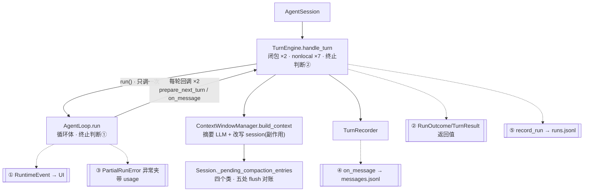

# Core 重构哲学

这份文档解释 core runtime 的一次重构(`refactor/core-loop` 分支,已合入 main):改了什么、为什么这么改、背后的判断标准是什么。它不是 API 文档,而是一份"如何看架构"的教材——目标是让你下次自己就能闻出同样的问题。文末第 9 节用重构后第一个真实功能(streaming)的落地数据,回头验证这些主张。

先给结论性的数字:这次重构删掉 5 个模块、新建 5 个模块,全项目净减约 890 行,同时**新增**了功能(run log 变成事件流的 fold)、保留了全部行为(178 个测试通过),核心不变量一条没丢。行数不是目的,是症状消失的副产品。

---

## 0. 重构前的病灶

三个问题,每个都是"局部合理、整体失衡"的典型:

1. **控制流倒置。** `AgentLoop` 名义上是循环,但"发什么上下文"和"消息去哪"是 `TurnEngine` 注入的两个闭包,闭包靠 `nonlocal` 改七个变量。读循环看不到状态,读闭包看不到循环。终止判断("这轮结束了吗")在两个文件里各写了一份,必须永远一致。
2. **五条输出通道。** 同一个 turn 的事实通过 RuntimeEvent、`on_message` 回调、`RunOutcome` 返回值、`PartialRunError` 异常(夹带 usage)、`record_run`(闭包攒的状态)五条路离开循环。每加一个功能要同时改五处。
3. **副作用藏在名叫 build 的函数里。** `ContextWindowManager.build_context` 会调摘要 LLM、改写 session、抛预算异常。因为变异发生在深层调用栈、落盘归另一个类管,只好发明 `_pending_compaction_entries` 缓冲,在四个类的五个位置手工对账。

画出来是这个形状——注意 TurnEngine 与 AgentLoop 之间那对方向相反的箭头(控制流折返),以及底部五条并行的输出通道:



重构后的形状(一条直线下来、一个出口扇出)见 [architecture.md](architecture.md) 的分层总览图,两张图对照看,形状差异就是这次重构的全部内容。

下面五条原则,每条对应一处刀口。

---

## 1. 循环拥有一切 —— 但只拥有"顺序",不拥有"机制"

**改动:** `TurnEngine` 并入 `AgentLoop`。`runtime/agent_loop.py` 的 `run_turn` 现在从上到下就是一个 turn 的完整生命周期:

```python
# runtime/agent_loop.py · run_turn 的骨架
self._emit_context_usage(session, emitter)
self._append(session, MessageEvent.create(role="user", content=user_input))

for iteration in range(1, self.max_iterations + 1):
    built, compact_message = self._prepare_context(...)   # ① 预算 + ② 拼装
    resp = self.llm.chat(built.messages, ...)              # ③ 模型
    if not resp.tool_calls:
        ...; return self._outcome(reply, usage, ...)       # 唯一的终止判断
    planned = self._plan_tool_calls(...)                   # ④ 工具
    outputs = self._execute_tool_calls(...)
    for planned, output in zip(...):
        self._append(session, tool_message)                # ⑤ 持久化 + 事件
```

**判断标准(这是本文最重要的一句):区分"编排"和"机制"。**

- 编排 = 决定"什么时候做什么",必须集中在一处,否则没人能读懂一个 turn。
- 机制 = "具体怎么做",必须分散在各自的模块里,否则循环变成 god object。

所以 `compaction.py`(找安全切点、拼摘要请求)一行没动;`ToolRegistry` 的并发模型一行没动;循环里只出现"判断 + 对具名组件的一次调用"。合并**没有增加任何耦合**——compact 本来就是循环内触发的,只是原来藏在三层调用后面;现在依赖方向从"循环 ⇄ 引擎"双向纠缠变成"循环 → 服务"单向。

三个可操作的检验问题,以后审查任何 agent runtime 都可以问:

1. 能不能在一个函数里从上到下读完一次 turn?(旧:不能;新:能)
2. 每个步骤能不能脱离循环单测?(旧:`build_context` 不能,因为有副作用;新:全部能)
3. 有没有被调用方反向够回调用者的状态?(旧:`nonlocal` ×7;新:没有)

**代价的诚实账:** `agent_loop.py` 从 632 行变成 608 行,没有更小——因为它吃下了 TurnEngine 的职责。但"总行数分布"变了:旧核心(loop+engine+context_manager+recorder+hooks)约 2170 行互相纠缠,新核心约 1670 行、每块可独立阅读。**可读性的单位是"理解一件事要打开几个文件",不是单文件行数。**

## 2. 一条输出通道,其余全是订阅者

**改动:** RuntimeEvent 流升级为唯一出口。四条旧通道的归宿:

| 旧通道 | 归宿 |
|---|---|
| `on_message` 回调 → TurnRecorder | 循环自己 `_append`(session 是循环的状态,不是观察者) |
| `record_run` → runs.jsonl | `RunLogFold`(`runtime/run_log_fold.py`)订阅事件流,在终止事件时写一行 |
| `RunOutcome` / `TurnResult` 两个结果类 | 一个 `TurnOutcome`,在一处构造 |
| `PartialRunError` 异常信封 | **直接删除**(见下) |

`PartialRunError` 之死值得单独讲,因为它演示了一类通用手法。这个异常存在的唯一理由是:LLM 中途失败时,把已经烧掉的 token usage 走私过异常边界,好让 run log 记上。一旦 usage 随每次 `model.request.completed` 事件即时离开循环,fold 天然攒着累计值——失败时它手里已经有了。**数据一旦即时发布,就不需要在错误路径上专门押运。** `tests/test_run_log_fold.py` 的 `test_partial_failure_keeps_usage_from_completed_calls` 验证了这一点:同样的部分失败场景,usage 分毫不差,而那个异常类不存在了。

"fold"这个词是函数式的说法:`runs.jsonl 的一行 = reduce(该 run 的所有事件)`。CLI 渲染是另一个 fold(事件 → 终端输出),SSE 是第三个(事件 → HTTP 流)。它们互不知晓,天然一致,因为读的是同一条流。接线只有一处,在 `bootstrap.py`:

```python
base_event_handler=fanout(
    RunLogFold(run_log_store, tool_registry=tool_registry),
    run_event_handler,
)
```

**判断标准:同一个事实需要离开模块时,数一数它走几条路。** 超过一条,每条都是一份要人工维持的一致性契约。

## 3. 副作用要显式,补丁会自己消失

**改动:** compaction 从 `build_context` 深处提升为循环的显式第①步。`ContextWindowManager`(655 行)裂解为三个各司其职的组件:

- `ContextBuilder`(206 行)——纯投影:消息进、请求出。不碰模型、不碰磁盘、不改 session。
- `TokenBudget`(120 行)——预算数学 + 基于 observed usage 的增量估算。
- `Compactor`(353 行)——压缩机制,**变异和落盘在同一个调用里完成**(`_apply_compaction`)。

最有教学价值的是消失的东西:`Session._pending_compaction_entries` 缓冲和它在四个类里的五个 flush 对账点,一并蒸发。这个缓冲当初不是谁犯蠢加的——它是"变异发生在深层调用栈、而调用栈可能在落盘前就抛异常"这个结构问题的**必然补丁**。把变异挪到显式位置、让做变异的人自己负责落盘,补丁就没有存在的理由了。

**判断标准:遇到"挂起状态 + 多处对账"这类代码,先别修它,先问它在补偿什么结构。** 补丁消失比补丁修好更能证明重构对了。附带一条:函数名承诺了什么就只做什么——叫 `build` 就不许写磁盘,叫 `reduce` 才可以。

## 4. 扩展点是被"拉"出来的,不是"推"出来的

**改动:** 八切点的 hook 框架(`hooks.py` 275 行 + 管道调度)整体删除。它唯一的真实用户——审批——变成显式依赖 `ToolApprovalGate`(`runtime/approval.py`),以构造参数注入循环。

为什么敢删?hook 的用途分两类,归宿不同:

- **观察类**(记日志、发指标)→ 被事件流吃掉。想观察就订阅,不需要注册进 runtime 内部。
- **干预类**(改写请求、拦截工具)→ 全项目只有审批一个。一个客户不值得养一个框架,而且审批塞在 hook 形状里本来就别扭:它是"阻塞等人类决策",被迫伪装成返回 decision 的转换器。

更隐蔽的成本:八个切点是八条公开契约,每条都钉死一个内部边界。`after_turn` 钉在 `_on_message` 闭包里、`after_context` 钉在 `prepare_next_turn` 里——hook 框架本身就是这次要拆的墙的一部分。**保留它,等于一边拆墙一边保护墙上的挂钩。**

**判断标准(YAGNI 的精确形式):只有一个消费者的抽象,形状几乎一定是错的,因为你没有第二个样本来交叉验证接口该长什么样。** 什么时候把 hook 加回来?等第二个干预类需求真实出现(策略引擎改写工具参数、prompt cache 注入器改写请求),拿着两个真实样本设计,而不是现在猜。

## 5. 删名词

每个数据类单独看都有道理,加起来就是认知负担。这次删掉的名词:`RunSpec`(装着活回调的"数据类")、`RunOutcome`、`TurnResult`、`PartialRunError`、`WorkingContext`、`HookContext`、`ModelRequest`、`ToolPrepareRequest`、`ToolExecuteDecision`、`RuntimeHook`、`RuntimeHookManager`、`TurnEngine`、`TurnRecorder`、`ContextWindowManager`。

新引入的:`TurnOutcome`、`BuiltRequest`、`ContextBuilder`、`TokenBudget`、`Compactor`、`ToolApprovalGate`、`RunLogFold`。净减一半,且每个新名词对应一个可以独立解释的职责,而不是一层接线。

**判断标准:名词应该命名"概念",不该命名"两层代码之间的缝"。** `WorkingContext` 和 `ModelRequest` 描述的其实是同一个东西在两个层之间的两次包装——缝合类的存在说明层切错了。

---

## 6. 旧世界 → 新世界对照表

| 旧 | 新归宿 | 文件 |
|---|---|---|
| `AgentSession` | 不变(锁、取消、run.* 事件、fanout 接线) | `runtime/agent_session.py` |
| `TurnEngine.handle_turn` | 并入 `AgentLoop.run_turn` | `runtime/agent_loop.py` |
| `RunSpec` + 两个闭包 | 普通参数 + 循环局部变量 | 同上 |
| `ContextWindowManager` | `ContextBuilder` + `TokenBudget` + `Compactor` | `runtime/context_builder.py` / `budget.py` / `compactor.py` |
| `TurnRecorder.on_message` | `AgentLoop._append` | `runtime/agent_loop.py` |
| `TurnRecorder.record_run` | `RunLogFold`(事件订阅者) | `runtime/run_log_fold.py` |
| `ApprovalHook` + hook 管道 | `ToolApprovalGate`(注入依赖) | `runtime/approval.py` |
| `PartialRunError` | 删除,usage 走事件 | — |
| `Session._pending_compaction_entries` | 删除,`Compactor` 即时落盘 | `session/models.py` |
| `compaction.py` / `token_budget.py` / 投影 / artifacts / 工具并发 | **原样保留** | — |

最后一行是重点:这次重构没有重写任何"机制",只重接了"谁在什么时候调用它们"。好零件 + 错误接线,是学习项目最常见的状态。

## 7. 怎么验证这些主张

测试套件本身就是论证的一部分:

- `tests/test_agent_loop_usage.py` —— 循环行为(usage 聚合、并发批次、审批拒绝、artifact)全部在**真实 session 落盘**下验证,不再需要 `_RecordingContext` 假回调。测试变简单,本身就是"接缝画对了"的证据。
- `tests/test_run_log_fold.py` —— 用与旧 `test_turn_engine_run_log.py` 相同的场景(成功、MCP 统计、启动前失败、部分失败)验证 fold 产出等价的 runs.jsonl 记录。
- `tests/test_context_compaction.py` —— 压缩机制不变,新增断言"落盘发生在 reduce 内部,无 pending 状态"。
- `tests/test_approval.py` —— 审批门的独立单测(拒绝不执行、取消抛 RunCancelled、handler 崩溃降级为错误输出)。
- 事件名和 payload 全部保持稳定,所以 CLI 状态行、SSE、web UI **零改动**通过原测试。

## 8. 什么时候该反着来

这些原则不是教条,写下反向条件才算诚实:

- **该拆循环的时候:** 如果将来出现第二种 loop(比如 planner/executor 双循环、或 subagent),"turn 的编排"和"loop 的复用块"才值得再分层。到那天你有两个真实样本,知道边界画哪。
- **该要 hook 框架的时候:** 出现第二个需要**改写**(而非观察)运行时数据的横切需求,且两者优先级/顺序有交互。
- **该给事件流分层的时候:** 订阅者需要不同的可靠性等级(比如"落盘必须成功,UI 可以丢")时,单一 fanout 不够,要引入分级投递。今天 session 落盘不走事件流(它是循环自己的状态),恰好绕开了这个问题——这是有意的设计,不是巧合。

## 9. 验证:streaming 落地的实测数据

重构时本节曾预言:这个形状会让 streaming 从"要动五层的大工程"变成"一个模块的活"。streaming 随后落地(`feat/streaming` 分支,含 CLI 打字机与 reasoning 折叠预览,真实 DeepSeek 端点端到端验证),预言可以对账了:

**核心数据路径只动了 4 个文件、+229 行**——`llm.py` 加 `LLMStreamEvent` 契约与 `chat_stream` 默认包装(+44),provider 实现原生流式(+135),循环第③步换成消费流并发 `message.delta` 事件(+56)。整个功能连测试、文档、两端渲染在内共 +1016 行,其中约六成是测试和 UI。

更有说服力的是**零改动清单**:`RunLogFold`、`Compactor`、`TokenBudget`、`ContextBuilder`、`session/`、`bootstrap.py` 一行未动。这正是各原则的直接兑现:

- **单一输出通道**(§2):新事件类型 `message.delta` 顺着现成的事件流到达所有订阅者,fold 对不认识的事件天然 no-op——runs.jsonl 不需要"学会"忽略 delta,它本来就只 fold 自己关心的事件。
- **delta advisory / completed authoritative** 是同一思想的延伸:delta 是新增的"观察",不是新的"真相"。真相仍是终局 `LLMResponse`,所以持久化、预算、compaction 全部无感。
- **编排与机制分离**(§1):循环只多了"消费流、转发 delta"这一层薄编排;流的解析机制(tool_call 分片拼装、usage 提取)全部在 provider 里。
- **扩展点被拉出来**(§4)再次生效:`chat_stream` 的默认实现包装 `chat`,让所有旧 provider 和测试 fake 零改动——这是"以响应为原语的迁移成本,拿到以流为原语的语义"。

一条可复用的评估方法:**给架构做"新功能压力测试"时,先写下预期的零改动清单,落地后对账。** 零改动清单越长、越核心,说明边界画得越对;反过来,如果一个"纯增量"功能迫使你改动持久化或记账层,那是边界错位的信号,该修的是边界而不是功能。
